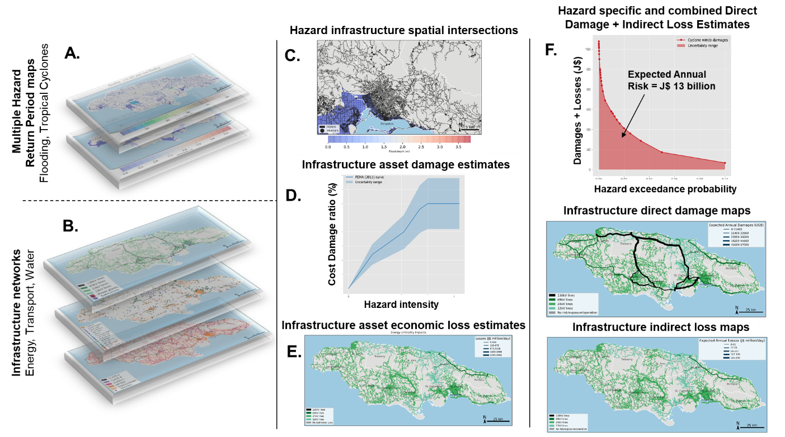

# Methodology development and implementation steps

## Types of assessment done through J-SRAT

The focus of this study is to create and implement a risk and climate adaptation
assessment framework for energy, transport and water infrastructure networks in
Jamaica. The implementation of this framework has led to the creation of the
Jamaica Systemic Risk Assessment Tool (J-SRAT).

The J-SRAT tool comprises:

1.  A methodology framework for spatial climate risk and adaptation
    analysis described in this report.

2.  A geospatial database of climate hazards, energy, transport and
    water networks, population, buildings with economic activities, and
    different land use dataset created for Jamaica.

3.  Open-source implementation codebase executed in Python programming
    language, available at:
    <https://github.com/nismod/jamaica-infrastructure> and
    <https://github.com/nismod/JEM>.

4.  A web-based visualisation tool of all underlying datasets and
    different risk and adaptation outputs from the analysis, available
    at: <https://jamaica.infrastructureresilience.org>.

The tool is capable of producing different types of system-of-systems
assessment useful for decision-making, which include:

- **Vulnerability assessment** -- _Vulnerability_ is defined as the
  propensity or predisposition of exposed elements such as
  infrastructures assets, human beings and economies to suffer adverse
  effects when impacted by hazard events[^18]. We measure
  vulnerability of infrastructures terms of the negative _impacts or
  consequences_ suffered due to failures induced by external hazard
  shocks[^19].

- **Criticality assessment** -- _Criticality_ is defined as a measure
  of an infrastructure assets' importance and disruptive impact on the
  rest of the network[^20]. Criticality assessment results in ranking
  network elements based on their relative impacts on the
  serviceability of the networks^19^.

- **Risk assessment** -- Climate _risks_ are measured as the product
  of the probabilities of hazards, exposures and vulnerabilities
  summed over all possible hazard and network failure and disruption
  scenarios. Climate risk evaluations rely on the use of climate
  projections, derived from Global (or Regional) Climate Models (GCMs
  and RCMs), which introduce large uncertainties associated decision
  making at the infrastructure-level[^21].

- **Adaptation assessment** -- Climate _adaptation assessment_ is the
  process of anticipating the adverse effects of climate change and
  evaluating the relative success of specific actions aimed at
  reducing climate vulnerabilities[^22]. Climate adaptation involves
  comparing the costs of the specific options with the benefits of
  avoided risks, realized over a time horizon and climate scenario.

## J-SRAT framework details and risk calculations

### Risk estimation framework

The different components in the J-SRAT framework that produce the
_climate vulnerability and risk assessment_ are shown in Figure 2‑1.
This framework has been created in a generic way in order to be
applicable to a wide range of hazard and infrastructure datasets. We
next explain the methodological steps in this system-of-systems
framework, and focus on the generic nature of the component models and
datasets involved in the analysis:

**Figure 2‑1: Framework for Jamaica Systematic Risk Assessment tool.**

A. **Hazard assembly** -- In this study we have assembled information
on different types of flood hazards (fluvial, pluvial and coastal
flooding) and tropical cyclones. We have also created a model for
drought estimation, applied only to potable water assets. Every type
of hazard (flooding, tropical cyclones and droughts) in our model is
represented and quantified through _static hazard maps_ that capture
the following parameters: (a) spatial extent; (b) magnitude; (c)
return period or the annual exceedance probability; (d) climate
scenario; and (e) time epoch. Details of these terms and the hazard
datasets assembled in this project are given in Section 3.1.

B. **Networks assembly** -- We have created spatial representations of
energy, transport and water infrastructure by assembling data on
point and line assets to create topologically connected networks
with attributes necessary for failure and damage analysis. In this
study this means collecting or inferring all location information of
point assets (railway stations, power plants, water treatment work,
etc.) and geometries of line and polygon assets (roads, railway
lines, electricity cables, pipes, ports, airports etc.), inferring
structural condition of assets (e.g., paved or unpaved roads), and
associating damage functions with different asset types, getting
rehabilitation costs of assets. We have also developed models for
mapping and modelling the services provided by networks to people
and the economy. This involves understanding the supply capacities
and demands associated with the usage of network assets. For
example, the volumes of freight transport through ports, airports,
roads, railway lines in tons/day; power plant capacities in MW,
voltages of substations and transmission lines in kV; water demand
in megalitres/day. Their measures are used in the estimation of
socio-economic metrics of infrastructure service use, which include
measures of the number of people and economic activity to network
assets. Details of each network model are provided in Section 3.2 --
3.4.

C. **Exposure analysis** -- Following the assembly of spatial hazard
and infrastructure network datasets, we undertake an exposure
analysis, which is done by performing spatial intersections of
hazards and network assets. This involves overlaying each hazard map
layer with each asset (point, line, polygon) and estimating: (a) the
magnitude of the hazard at the location of the asset; (b) the extent
of the line and polygon assets that are within the hazard areas
given by the hazard map layer. The process of exposure analysis
results in compiling hazard levels and spatial extents affecting
each infrastructure asset across all return periods, climate
scenarios, and time epoch of every hazard type. This leads towards
the estimation of direct and indirect risks associated with assets
and network failures.

D. **Direct damages estimation** -- Following the exposure analysis,
estimation of _direct damages_ (or _direct damage costs_) to assets
is done to quantify the _rehabilitation costs_ (in J\$ or US\$) of
assets subjected to different hazard shocks across current and
future climate scenarios. The direct damage estimation is done
by: (a) selecting a level of hazard that might cause physical damage
to assets such that they will be a need to rehabilitate them; (b)
looking up fragility or vulnerability functions, which quantify the
percentage (or fraction) of damage sustained by an asset for a given
magnitude of a hazard. In our analysis we also combine the
uncertainties of vulnerability functions and asset unit costs, to
quantify a range of direct damage costs to assets exposed to
hazards.

E. **Indirect economic loss estimation** -- This involves measuring the
service and socio-economic losses that are associated with the
damaged and hence failed assets. This is done by incorporating the
effects of disruptions to infrastructure networks' overall
performance and services, following direct damage assessment of
individual (or groups of) assets. The effects of network-wide
disruptions are measured in terms of disrupted customers or users of
the network services, which include households and businesses. These
user-disruption metrics are common across all networks and provide a
systemic understanding of the importance of different networks and
services at a larger regional or national scale. A more complete
loss assessment is done by estimating the economic losses to
businesses and the wider economic supply chains affected by
infrastructure failures and disruptions. Such _indirect economic
losses_ are calculated at macroeconomic scales by translating the
business and supply chain disruptions to Gross Domestic Product
(GDP) and trade losses in J\$/day (or US\$/day). Infrastructure
network specific models for estimation of indirect economic losses
are described in further detail in Section 3.2 -- 3.4.

F. **Different risk outcomes** -- Risks at the asset-level are
estimated as a function of the hazard annual exceedance
probabilities and the total impacts (direct damages plus indirect
losses). Due to the uncertainties associated with hazard events and
climate scenarios, asset fragilities, and disruption impacts the
risks associated with an individual failure scenario are not
expressed as a single estimate, but rather a range of values. In
this study we estimate two risk metrics:

a. **Expected Annual Damage (EAD)** -- This is the measure of the
average damage costs (in J\$ or US\$) incurred for an asset in
any given year due to a given hazard type for a given time epoch
and climate scenario. For a given asset and hazard, EAD at the
asset level is estimated by first constructing the
damage-probability curve, which is done by estimating the direct
damages $d_{1},\ldots,d_{m}$ associated with increasing annual
exceedance probabilities$\ p_{1},\ldots,p_{m}$. The EAD is
estimated as the area under the damage-probability curve, which
is described in Equation (1).

> ${EAD}_{\ } = \ \frac{1}{2}\sum_{k = 1}^{m}{\left( p_{k + 1} - p_{k} \right)\left( d_{k} + d_{k + 1} \right)}$
> (1)

b. **Expected Annual Economic losses (EAEL)** -- This is the measure of
the average economic losses (in J\$ or US\$) incurred for an asset
in any given year due to a given hazard type for a given time epoch
and climate scenario. For a given asset and hazard, EAEL at the
asset level is estimated by first constructing the loss-probability
curve, which done by estimating the economic losses
$l_{1},\ldots,l_{m}$ associated with increasing annual exceedance
probabilities $\ p_{1},\ldots,p_{m}$. The EAEL is estimated as the
area under the loss-probability curve multiplied by an assumed
duration of disruption $\tau$ for the asset, which is described in
Equation (2).

> ${EAEL}_{\ } = \ \frac{1}{2}\tau\sum_{k = 1}^{m}{\left( p_{k + 1} - p_{k} \right)\left( l_{k} + l_{k + 1} \right)}$
> (2)

From the estimate of EAD and EAEL we get the asset level _total risk_ =
EAD + EAEL. There are different ways in which the risk estimates can be
presented, either through the damage (loss)-probability curves or as a
network map highlighting the most critical assets across the country in
terms of value of EAD and EAEL estimates (see panel F in Figure 2‑1).

### Adaptation assessment and calculations

After having done an estimation of asset level risks across multiple
hazards, climate scenarios, time epochs, we can do an adaptation
assessment with respect to a set of adaptation options. The aim of this
study is to quantify the effectiveness of adaption options with
estimated costs for building resilience (to climate shocks) of
individual assets and networks. This is done through a cost-benefit
analysis of a chosen option, where the costs of an adaptation option are
compared with the benefits due to reduced or avoided risks. The
estimating of costs, risk reduction benefits and co-benefits of
adaptation options leads towards prioritisation of investment
interventions, which is done by evaluating different options and ranking
them by their benefit-cost ratios. Section 3.5 describes the specific
types of adaptation options considered in the J-SRAT tool. Here we focus
on the general process of quantifying the effectiveness of any
adaptation option irrespective of climate hazard or infrastructure
network.

The effectiveness of any adaptation option is evaluated and compared
through a Cost-Benefit Analysis (CBA), which is a well-established
technique to compare the costs of an option with its benefits[^23]. The
planning for an adaptation option is done on an annual time-scale
$t_{0},\ldots,t_{T}$, starting at the time $t_{0}$ when the adaptation
option is implemented and continues over its planned time horizon $T$.
Assuming $r$ is the rate for discounting costs and benefits over time in
%, and $j$ is the count for the years over which the value of adaptation
is evaluated, the effectiveness of this adaptation option is quantified
in terms of the:

1.  _Costs_ -- which includes the initial cost of investment
    (${CI}_{t_{0}}$) of implementing the adaptation option at the start
    year $t_{0}$, and the costs of routine (${CR}_{t_{j}}$) and periodic
    maintenance (${CP}_{t_{j}}$) investments needed to maintain the
    adaptation option over the time horizon. The total net present value
    of the investment cost of the adaptation options over the asset
    timeline is therefore given by Equation (3).

> $NPV\ Cost = \ {CI}_{t_{0}} + \ \sum_{j = 0}^{j = T}\frac{{CR}_{t_{j}} + {CP}_{t_{j}}}{\left( 1 + \frac{r}{100} \right)^{j}}$
> (3)

2.  _Benefits_ -- which include the avoided losses, in terms of the
    expected reduction in direct damage risks
    (${\mathrm{\Delta}EAD}_{t_{j}} = {EAD}_{t_{j}} - {\widehat{EAD}}_{t_{j}}$)
    and the indirect economic
    losses(${\mathrm{\Delta}EAEL}_{t_{j}} = {EAEL}_{t_{j}} - {\widehat{EAEL}}_{t_{j}}$),
    without ($EAD,EAEL$) and with ($\widehat{EAD},\widehat{EAEL}$) the
    adaptation option implemented. Over time the EAELs are also assumed
    to grow (or decline) based on annual % GDP growth rates
    ${\mathrm{\Delta}GDP}_{j}$ over the years. The total net present
    value of the benefits over the implementation of the adaptation
    option timeline is therefore given by Equation (4).

> $NPV\ Benefit = \ \sum_{j = 0}^{j = T}\left( \frac{{\mathrm{\Delta}EAD}_{t_{j}} + \left( 1 + \frac{{\mathrm{\Delta}GDP}_{j}}{100} \right)^{j}\mathrm{\Delta}{EAEL}_{t_{j}}}{\left( 1 + \frac{r}{100} \right)^{j}} \right)$
> (4)

3.  The _benefit-cost ratio_ ($BCR$) of adaptation given as:

> $BCR = \frac{NPV\ Benefit}{NPV\ Cost}\ $ (5)

The above CBA analysis helps identify the effectiveness of adaptation
options at the asset level, which can also be used to prioritise assets
and locations for investments by either focusing on all assets with
$BCR \geq 1$ or only targeting the few assets with the
highest BCR. At the aggregated regional levels, we can use this analysis
to estimate the total budget needed for investing in climate adaptation
for assets with $BCR \geq 1$.

## Output metrics

A summary of the main output metrics developed in this study, their
associated units, and types of results, are shown below in Table 2‑1.
These output metrics can be presented at different spatial scales:

1.  **Infrastructure asset scale** -- where the particular individual
    infrastructure assets are identified, and their systemic metrics are
    estimated.

2.  **Regional scale** -- where the metrics are aggregated at regional
    scales within Jamaica by adding up the asset level values. For
    example, the Parish level damages and losses of energy assets due to
    flooding can be estimated by adding up the value for each asset
    within the Parish boundaries.

3.  **National scale** -- where aggregated metrics are presented at the
    scale of the whole of Jamaica by adding up the asset level values.

**Table 2‑1: Overview of metrics that are produced from the J-SRAT
implementation.**

| Stage                                    | Type of metric                         | Metric descriptions                                                                                                | Unit              |
| ---------------------------------------- | -------------------------------------- | ------------------------------------------------------------------------------------------------------------------ | ----------------- |
| Hazard exposure                          | Numbers                                | Number of assets exposed to every hazard layer                                                                     | –                 |
| Hazard exposure                          | Lengths and Areas                      | Lengths and areas of assets exposed to every hazard layer                                                          | m and m²          |
| Vulnerability and criticality assessment | Direct damages                         | Rehabilitation costs for an asset damaged by each hazard layer                                                     | US$ or J$         |
| Vulnerability and criticality assessment | Indirect economic loss – Energy/water  | GDP disruptions to households and businesses due to loss of network service following an asset damaged by a hazard | US$/day or J$/day |
| Vulnerability and criticality assessment | Indirect economic loss – Transport     | Trade and passenger flow losses on network due to an asset damaged by a hazard                                     | US$/day or J$/day |
| Vulnerability and criticality assessment | Population/User disruptions            | Number of people/households disrupted due to loss of network services                                              | People/day        |
| Risk assessment                          | Expected annual damages (EAD)          | Direct risks                                                                                                       | US$ or J$         |
| Risk assessment                          | Expected annual economic losses (EAEL) | Indirect risks                                                                                                     | US$ or J$         |
| Adaptation assessment                    | NPV costs                              | Total cost of adaptation over an implementation timeline                                                           | US$ or J$         |
| Adaptation assessment                    | NPV benefits                           | Total benefit of adaptation over an implementation timeline                                                        | US$ or J$         |
| Adaptation assessment                    | BCR                                    | Benefit–Cost Ratio                                                                                                 | –                 |

## Implementation steps of the J-SRAT methodology

As noted previously, the J-SRAT analysis is implemented in a Python
programming environment. Here, we summarise the overall sequence of
steps in implementation of the J-SRAT risk and adaptation assessment
methodology.

**Table 2‑2: Implementation steps of the J-SRAT methodology.**

### Step 1

Collect climate hazard layers with:

- Annual exceedance probabilities (1/return periods)
- Magnitudes
- Spatial area coverage
- Climate scenarios
- Time epochs

### Step 2

Assemble and create spatial population, economic activity and land-use data and
models with:

- Populations assigned to areas
- Buildings assigned to specific economic sectors
- Areas of agriculture, mining, and other types of
  activities
- GDP associated with buildings and land-use activities

### Step 3

Assemble and create spatial energy, transport and water infrastructure asset and
network data and models with:

- Locations and geometries of points, lines and polygons
- Information on network connectivity
- Asset and sector relevant attributes -- e.g. asset types, capacity, dimensions
- Rehabilitation costs
- Network service flow allocation to locations of
  populations, buildings and land-use to determine location
  specific GDP dependent upon infrastructure assets

### Step 4

Assemble information on hazard and asset specific vulnerability curves with:

- Hazard and asset type
- Hazard magnitude
- Percentage damage to asset for given hazard magnitude

### Step 5

Intersect hazards and assets and estimate the direct exposure statistics --
numbers, lengths, areas of assets exposed to each hazard layer

### Step 6

Estimate the set of assets damaged by each hazard layer, and estimate the direct
damages from the exposures, vulnerability curves and rehabilitation costs

### Step 7

Estimate the economic losses for damaged assets by implementing sector specific
network models that quantify the network losses in terms of the population and
GDP disrupted by asset failures

### Step 8

Collect the asset specific damages and losses for each hazard return period,
climate scenario, time epoch

### Step 9

Calculate EAD and EAEL, from Equations (1)-(2), for each hazard, climate
scenario, time epoch

### Step 10

Assemble adaptation options data with:

- Type of hazard specific option
- Effectiveness of option in reducing hazard
- Initial investment costs and maintenance costs and schedules over time
- Discounting rates, GDP growth factors over timeline for implementation of
  option

### Step 11

Repeat Steps 5-9 to calculate new asset level risks corresponding to the hazards
with the adaptation options in place

### Step 12

Estimate the NPV of adaptation costs, NPV of benefits and BCR values from
Equations (3)-(5)

### Step 13

Integrate results of the analysis into J-SRAT visualisation tool.

[^18]:
    Cardona, O.D., M.K. van Aalst, J. Birkmann, M. Fordham, G.
    McGregor, R. Perez, R.S. Pulwarty, E.L.F. Schipper, and B.T. Sinh. 2012. Determinants of risk: exposure and vulnerability. In:
    _Managing the Risks of Extreme Events and Disasters to Advance
    Climate Change Adaptation_ \[Field, C.B., V. Barros, T.F. Stocker,
    D. Qin, D.J. Dokken, K.L. Ebi, M.D. Mastrandrea, K.J. Mach, G.-K.
    Plattner, S.K. Allen, M. Tignor, and P.M. Midgley (eds.)\]. A
    Special Report of Working Groups I and II of the Intergovernmental
    Panel on Climate Change (IPCC). Cambridge University Press,
    Cambridge, UK, and New York, NY, USA, pp. 65-108.

[^19]:
    Pant, R., Hall, J.W. and Blainey, S.P. 2016. Vulnerability
    assessment framework for interdependent critical infrastructures:
    case-study for Great Britain's rail network. *European Journal of
    Transport and Infrastructure Research*, *16*(1).

[^20]:
    Arga Jafino B. Measuring Freight Transport Network Criticality: A
    Case Study in Bangladesh. TU Delft; 2017.

[^21]:
    Gersonius, B., Ashley, R., Pathirana, A. and Zevenbergen, C., 2013. Climate change uncertainty: building flexibility into water
    and flood risk infrastructure. *Climatic change*, *116*(2),
    pp.411-423.

[^22]:
    Möhner, A. 2018. The evolution of adaptation metrics under the
    UNFCCC and its Paris Agreement. In Christiansen, L., Martinez, G.
    and Naswa, P. (eds.) _Adaptation metrics: perspectives on measuring,
    aggregating and comparing adaptation results_. UNEP DTU Partnership,
    Copenhagen.

[^23]:
    Pearce, D., Atkinson, G. and Mourato, S., 2006. *Cost-benefit
    analysis and the environment: recent developments*. Organisation for
    Economic Co-operation and development.

## Contents

1. [Introduction](01-introduction.md)
2. [Methodology development and implementation steps](02-methodology.md)
3. [Model assumptions and data assembled for implementing J-SRAT](03-model-assumptions-data.md)

- [Appendix A: Vulnerability curves for infrastructure assets in Jamaica](appendix-a-vulnerability-curves.md)
- [Appendix B: Hazard models](appendix-b-hazard-models.md)
- [Appendix C: Infrastructure network flow models for failure analysis](appendix-c-network-flow-models.md)
- [Appendix D: Spatial disaggregation of economic activity at buildings and area levels](appendix-d-spatial-disaggregation.md)
