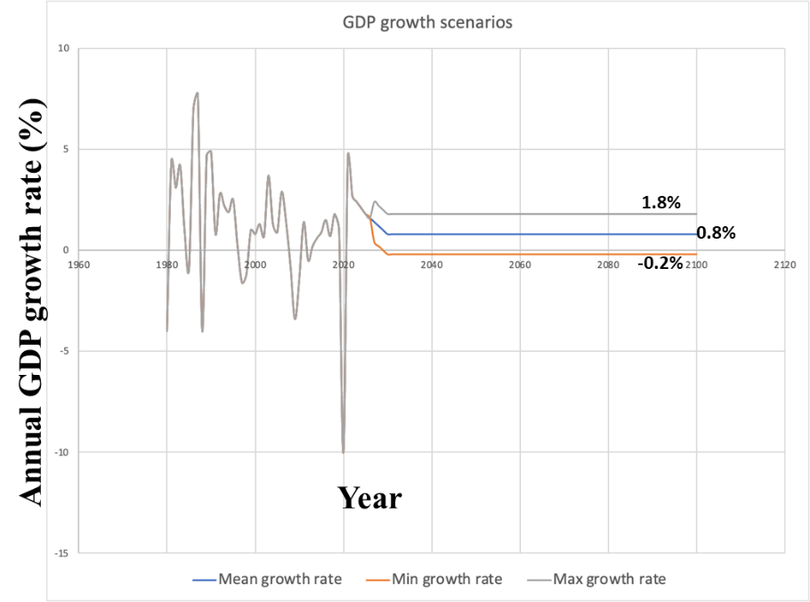

# Model assumptions and data assembled for implementing J-SRAT

To implement the J-SRAT methodology a number of different types of model
assumptions and datasets are needed, and the confidence in the outputs
depends heavily on the quality of the underlying datasets. In this
project, all infrastructure and socio-economic datasets have been
assembled from existing information compiled by ministries, government
departments and other agencies managing data on energy, water, transport
systems in Jamaica. We have leveraged upon high quality hazard datasets
derived from global products for the analysis. There are also many model
generalised model assumptions made in the risk assessment process, which
are derived from previous studies in Jamaica or other studies relevant
to the Caribbean region. Here we describe the underlying model
assumptions and data created in the study.

## Generic methodology assumptions

The following assumptions are applied in a generalised sense in the
implementation of the risk and adaptation calculations.

1.  The current (baseline) year for estimation of risks is chosen to
    be 2019. All rehabilitation cost estimates of assets and the
    economics statistics data used are in 2019 J\$ values.

2.  Where cost information was available in US\$ it was converted to J\$
    by assuming the conversion rate of 1U\$ = 150 J\$.

3.  In the adaptation options assessment the timeline of an option is
    assumed to be from the current year = 2019 to the end of century
    = 2100. This very long timeline is chosen simply because some of the
    climate change driven hazard datasets give future values until 2100.

4.  In the adaptation cost-benefit analysis calculations the discount
    rate = 10%, which comes from previous projects data in Jamaica[^24].

5.  The assumed GDP growth rate trajectory for Jamaica till the end of
    the century is shown in Figure 3‑1. The historical data and
    forecasts till 2025 are from the International Monetary Fund
    (IMF)[^25], while further projection of constant GDP rate profile
    with lower and upper bounds are our own estimates.

    

**Figure 3‑1: GDP growth rate forecasts for Jamaica showing the historic
rates and projection till 2025 from IMF data (grey line), while further
projections from 2025-2100 are done by assuming a constant mean rate
(blue line) with a lower (orange line) and upper (grey line) bound.**

6.  It is assumed that not all hazard types will cause damage to
    infrastructure assets even if there are known exposures to these
    hazards. Table 3‑1 shows the assumed cases of hazard exposures that
    could potentially lead to failures of different types of assets with
    infrastructure sectors. For example, from Table 3‑1 we can infer
    that in our analysis it is assumed that energy transmission lines
    and poles will not be affected and damaged by flooding while road
    and railway assets will not be physically damaged by extreme winds.

**Table 3‑1: All assumed instances of types of hazards exposures, which
could lead to infrastructure asset damages for the assets considered in
Jamaica (Y=Yes, N=No).**

| Sector    | Sub-sector                                  | Fluvial, pluvial and coastal flooding | Tropical cyclone winds              |
| --------- | ------------------------------------------- | ------------------------------------- | ----------------------------------- |
| Energy    | Generation & substations                    | Y (excluding solar and wind plants)   | Y (excluding solar and wind plants) |
| Energy    | Transmission & distribution poles and lines | N                                     | Y                                   |
| Transport | Airports                                    | Y                                     | Y                                   |
| Transport | Ports                                       | Y                                     | Y                                   |
| Transport | Railways                                    | Y                                     | N                                   |
| Transport | Roads                                       | Y                                     | N                                   |
| Water     | Potable water                               | Y                                     | Y                                   |
| Water     | Irrigation                                  | Y                                     | N                                   |
| Water     | Wastewater                                  | Y                                     | N                                   |

7.  It is assumed that damage to infrastructure assets will occur only
    when the hazard magnitude affecting them would be above a certain
    threshold value. This is done in order to avoid over-estimation of
    damage due to exposures, since assets would generally be built to
    withstand lower magnitudes of hazards. For example, 0.1 meters of
    flood depth might not be severe enough to cause any damage to
    assets. Table 3‑2 shows the assumed failure threshold values for the
    magnitudes of each hazard type, where the flood depth threshold
    values are chosen based on previous studies in Jamaica[^26] and the
    tropical cyclone wind speed threshold is chosen based on the
    Saffir-Simpson Hurricane wind speed scale in which a category 1
    hurricane wind speeds have a lower bound close to 30 m/s and can
    potentially cause damage to overhead lines and poles in electricity
    networks[^27].

8.  The infrastructure vulnerability curves with respect to flooding and
    cyclone hazards are explained and shown in detail in Appendix A.
    Flood vulnerability curves are generally created for freshwater
    flooding (fluvial and pluvial), while coastal flooding due to storm
    surges can be more corrosive due to saltwater. Previous flood damage
    assessment studies in Jamaica assumed damages due to saltwater
    flooding were 12% higher than freshwater for the same flood
    depths^26^, which we adopt. Table 3‑2 shows how the 12% increase in
    vulnerability for coastal flooding exposures is accounted for
    through an uplift factor, which is a parameter multiplied to the
    vulnerability curve to scale it up or down.

**Table 3‑2: Hazard specific thresholds and vulnerability uplift factors
assumed for direct damage assessment of assets in Jamaica.**

| Hazard type                     | Failure threshold value | Vulnerability curve uplift factor |
| ------------------------------- | ----------------------: | --------------------------------: |
| Coastal flooding (flood depths) |                   50 cm |                              1.12 |
| Fluvial flooding (flood depths) |                   50 cm |                                 1 |
| Pluvial flooding (flood depths) |                   50 cm |                                 1 |
| Tropical cyclones (wind speeds) |                  30 m/s |                                 1 |

## Hazard data assembly

In this study we are looking at infrastructure risks due to climatic
hazards such as flooding (coastal, river (fluvial), surface water
(pluvial)), tropical cyclones and droughts. For flood and tropical
cyclone hazards we have static hazard layers that show the hazard
outlines, intensities, and exceedance probabilities (or return periods),
for present and future climate scenarios. We note that for flooding and
tropical cyclone hazards we have not created any hazard models
ourselves, so we rely on the hazard datasets and model outputs created
by other organisations. Appendix B.1- B.3 describes the models behind
the flooding and tropical cyclone datasets.

All the flooding and tropical cyclone datasets have the following
information.

1.  **Spatial extent** -- The area over which the hazard exists.

2.  **Magnitude** -- The value that captures the severity of the hazard
    over an area. For example, flood depth in meters or wind speeds in
    m/s.

3.  **Return period (or 1/occurrence probability)** -- The probability
    or chance that a hazard might occur in any given year is expressed
    in terms of the return period[^28]. For example, a 100-year return
    period hazard has a 1/100 or 1% chance of occurring in any given
    year.

4.  **Climate scenario** -- The climate scenarios associated with a
    hazard map show how the hazards might change in the future based on
    Representative Concentration Pathways (RCPs) as defined by the
    Intergovernmental Panel on Climate Change (IPCC)[^29].

5.  **Time epoch** -- These are specific slices of time in years that
    show representative hazard maps corresponding to the climate
    scenario induced changes. Generally, climate scenario induced
    changes are seen in time scale of decades. Hence, the time epochs
    are represented in the hazard maps in some long-term future year
    rather than the current baseline year (example 2030, 2050, 2080).

For droughts we built our own model, which involved collecting data of
daily stream flows (in m^3^/s) at specific river gauge locations in
Jamaica and creating a timeseries of current and future stream flows
under changes to temperature and precipitation driven by different
climate scenarios. Appendix B Section B.4 describes the model in further
detail.

Table 3‑3 describes the details of the hazard datasets compiled for this
study and Figure 3‑2 shows the sample outputs for coastal flooding maps
in present and future time epochs.

**Table 3‑3: List of hazard datasets assembled for the study.**

| Hazard type (data source)                                                         | Annual exceedance probabilities (1/return period, years) | Magnitudes and spatial extents                                      | Climate scenario information                                                     | Time epochs                                                    |
| --------------------------------------------------------------------------------- | -------------------------------------------------------- | ------------------------------------------------------------------- | -------------------------------------------------------------------------------- | -------------------------------------------------------------- |
| Fluvial (river) and pluvial (surface water) flooding (JBA Global Flood Map) [^30] | 1/20, 1/50, 1/100, 1/200, 1/500, 1/1,500                 | Flood depths (m) over 30 m grid squares                             | 1 current + 2 future climate model outputs; RCP 2.6, 4.5, 8.5 emission scenarios | Current (2019) + future maps in 2050 and 2080                  |
| Coastal flooding (Deltares Global Flood Map) [^31]                                | 1/1, 1/2, 1/5, 1/10, 1/50, 1/100                         | Flood depths (m) over 90 m grid squares                             | 1 current + 1 future climate model output; RCP 2.6, 4.5, 8.5 emission scenarios  | Current (2019) + future maps in 2030, 2050, 2070, 2100         |
| Tropical cyclones (STORM IBTrACS model) [^32]                                     | 26 exceedance probabilities from 1/1 to 1/10,000         | 10-minute sustained maximum wind speeds (m/s) at 10 km grid squares | 1 current + 1 future climate model output; RCP 4.5 and 8.5 emission scenarios    | Current (2019) + future maps in 2050 and 2100                  |
| Droughts (own model)                                                              | No recurrence probabilities                              | Daily streamflow (m³/s)                                             | 1 current + 1 future climate model output; RCP 2.6, 4.5, 8.5 emission scenarios  | Current (to 2019) + future climate scenario timeseries to 2100 |

## Socio-economic model and data assembly

For economic loss analysis, we have assembled and created population and
economic activity datasets that we use with every infrastructure sector
model in this study.

### Population data creation

The most spatially disaggregated population data for Jamaica was
available at 5,776 Enumeration District (ED) levels, which was created
by the Statistical Institute of Jamaica (STATIN) using 2011 census
population estimates[^33], which was the last detailed census recorded
in Jamaica. From this dataset we get estimates of two quantities: (1)
total number of people within an ED and (2) total working population
within an ED, which we assume to be people in the age group 19 -- 79
years.

We also use data from STATIN on the total annual population at the
Parish level from 2011-2019[^34], which give estimates for 2019 (the
baseline year for our analysis) as shown in Table 3‑4. We estimate the
percentage change in population between 2011 and 2019 levels at the
Parish level and assume the total and working populations for all ED
levels within a Parish also change by the same rate. Figure 3‑3 shows
the distribution of the 2019 population estimates at the ED levels.

### Economic activity assigned to building footprints

In Jamaica there are no datasets that provide information on spatial
economic activity below national level statistics. We therefore created
a first-of-its-kind spatial economic activity dataset at the level of
995,984 buildings in Jamaica. The aim of this dataset is to: (1)
represent the type of buildings in Jamaica as residential and different
types pf non-residential; (2) assign economic activities to
non-residential buildings in terms of the GDP/day that might be
generated by them; (3) map the buildings to different infrastructure
networks to infer the dependence of economic activities on
infrastructure services and (4) estimate the value of economic activity
disrupted when the buildings lose their access to infrastructure
services due to infrastructure damage.

To create the final building level economic outputs in GDP/day, data was
gathered from the following organisations:

- OpenStreetMap (OSM)

- Humanitarian OpenStreetMap Team (HOT)

- National Environment and Planning Agency (NEPA)

- National Land Agency (NLA)

- Forestry Department (FD)

- The Nature Conservatory (TNC)

- Office of Disaster Preparedness and Emergency (ODPEM)

- Parish Municipal Corporations (PMC) -- Manchester, Portland, St.
  Elizabeth, Clarendon, Kingston and St. Andrews

- National Spatial Data Management Division (NSDMD)

- Statistical Institute of Jamaica (STATIN)

The process of economic activity assignment involved geotagging
buildings as residential and belonging to specific macroeconomic sectors
in Jamaica. Based on data from STATIN we followed the Jamaica Industry
Classification (JIC) 2005 nomenclature[^35] to identify buildings
belonging to macroeconomic sectors described in Table 3‑5 and Appendix D
Table D-1. We note the following:

1.  A more recent JIC 2016 system does exist[^36], but detailed
    macroeconomic statistics are still provided according to the JIC
    2005 system. Hence, we adopted the JIC 2005 system to group
    buildings into macroeconomic sectors.

2.  We have excluded the infrastructure specific macroeconomic sectors
    from the classification below, since GDP associated with
    infrastructures was estimated using the non-building dataset
    described in Section 3.4.

3.  We note that we have also excluded some sectors, such as Private
    Households with Employed Persons, in our data because it was not
    possible to infer which buildings they could be assigned to.

4.  A more detailed industry breakdown of the JIC 2005 sectors into
    further sub-sectors with Gross Value Added (GVA) and total GDP at
    current prices for the year 2019 was provided by STATIN[^37]. This
    is reported in Appendix D Table D-1, from which we assigned sector
    and subsector specific GDP values to the building levels.

**Table 3‑5: Jamaica Industry Classification (JIC) 2005 based codes and
names of macroeconomic sectors.**

| JIC code | JIC sector name                                                                                    |
| -------- | -------------------------------------------------------------------------------------------------- |
| A        | Agriculture, hunting and forestry                                                                  |
| B        | Fishing                                                                                            |
| C        | Mining and quarrying                                                                               |
| D        | Manufacturing                                                                                      |
| F        | Construction                                                                                       |
| G        | Wholesale and retail trade; repair of motor vehicles, motorcycles and personal and household goods |
| H        | Hotels and restaurants                                                                             |
| I        | Transport, storage and communications (postal services)                                            |
| J        | Financial intermediation                                                                           |
| K        | Real estate, renting and business activities                                                       |
| L        | Public administration and defence, compulsory social security                                      |
| M        | Education                                                                                          |
| N        | Health and social work                                                                             |
| O        | Other community, social and personal service activities                                            |

The first operation of simply geotagging buildings involved the
following steps:

1.  The baseline buildings polygon datasets were obtained from OSM and
    HOT, which are open and free datasets [^38] , [^39] . Within these
    datasets several buildings were already tagged in terms of their
    usage. For example, several schools, hospitals, hotels, etc. were
    geolocated and tagged in the data, to which we could then assign the
    correct JIC sector codes (M, N, H, etc.).

2.  Several datasets from an NSDMD database also provided locations of
    known schools, hospitals, institutions, industrial and manufacturing
    sites in Jamaica, which was spatially intersected and mapped onto
    the buildings polygons to further infer the building usage and
    assign JIC sector codes.

3.  Land parcel datasets from NLA, NEPA, ODPEM and PMC helped identify
    large numbers of buildings within areas designated for specific
    types of construction, and especially separate out residential areas
    from non-residential ones. Figure 3‑4 shows an example of buildings
    overlaid with different land planning classes, from which we know
    that all areas coloured in pink are designated residential areas and
    so all buildings within pink areas will be residential.

4.  The remaining buildings, especially those belonging to agriculture,
    fishery and mining sectors were tagged based on different land use
    datasets from NEPA, TNC, and FD.

| Type          | Meaning            |
| ------------- | ------------------ |
| Commercial    | Sector G           |
| Industrial    | Sector A, B, C, D  |
| Institutional | Sector L, M, N     |
| Mixed Use     | More than one type |
| Other         | No sector mapped   |
| Recreation    | Sector O           |
| Residential   | Residential only   |
| Resort        | Sector H           |

Following the creation of the sector specific geotagged buildings, we
disaggregated the national scale GDP estimates (given in Appendix D
Table D-1) to the building stock mapped to each sector and subsector.
For buildings assigned to sectors D -- O we applied the method described
in Appendix D Section D.2, which gave us the GDP/day for each building.

### Land-use data with economic activity assignment

Economic activity assigned to the Agriculture (A), Fishery (B) and
Mining (C) sectors in Jamaica in GDP/day/area was done over areas where
these activities were taking place, instead of building scale. If
buildings were located within these areas, then the GDP/day over the
areas of the buildings was then estimated. For creating these estimates,
data was gathered from the following organisations.

- Forestry Department (FD)

- The Nature Conservatory (TNC)

- National Spatial Data Management Division (NSDMD)

- International Food Policy Research Institute (IFPRI)

- Statistical Institute of Jamaica (STATIN)

The process of assigning GDP/day to agricultural areas is explained in
detail in Appendix D Section D.3. In general, we aimed to create
approximate estimates of the concentration of agricultural output over
different areas in Jamaica. No such data exists in Jamaica or if it does
then we were not made aware of it. To estimate spatial agriculture
output, we use the land-use datasets from FD and TNC to first identify
the areas designated as agricultural land and different crop types, and
then - using gridded datasets of crop level agricultural output
estimates from IFPRI - we map the intensity of agricultural outputs (in
US\$/m^2^) over the agriculture land areas for different crops. Finally,
the overall agriculture sector and subsector GDP estimates (from Table
D-1) are spatially disaggregated in proportion to the intensity of
agriculture output estimates.

For assigning Fishery sector GDP spatially across Jamaica we used a
dataset on Aqua Farms compiled in the NSDMD database (and originally
from Fisheries Division, Mona Geoinformatics), which gave information of
the size of farm lots in terms of the acres devoted to fisheries
production. We used this information to assume that the whole fishery
sector GDP was assigned to each farm area in proportion to its size.

The process of assigning GDP/day to mining and quarrying sector is
explained in detail in Appendix D Section D.4. Mining and quarrying
sector GDP was spatially disaggregated over areas of mining and
quarrying land-use from the FD and TNC datasets, through port statistics
on tonnages of mining and quarrying produce sent out for export.

## Infrastructure asset and network model and data assembly

The energy, transport and water infrastructure systems being analysed in
this study are conceptualised as spatial network models. A network is a
collection of points (or polygon) assets called _nodes_ or _areas_
(power plants, railways stations, ports, dams) connected by line assets
called _edges_ (electricity lines, railway tracks, pipelines). The term
asset is also used to refer to a node, area or edge. Appendix C Section
C.1 explains the general network formulation adopted in this study.

### Energy systems model and data

In this project we have created a Jamaica Energy Model (JEM), which is a
power systems model which aims to: (1) create a high-level
representation of Jamaica's electricity network; (2) represent how
electricity would flow across Jamaica from locations of supply to meet
demands across the country; (3) quantify the network flow losses due to
asset damage from climatic hazards; and (4) provide risk outcomes that
feed into the overall J-SRAT process to help identify the assets and
regions that are most vulnerable to current and future climatic hazards.

Appendix C Section C.2 describes the technical details of the JEM. The
JEM is a high-level optimal power flow model, which computes energy
balances across the system, using defined supply and demand curves. It
uses a mass-balance formulation, which is solved with an underlying
network linear programming (optimisation) algorithm. JEM has been
implemented in Python with the codebase available at:
<https://github.com/nismod/JEM>.

The Jamaica energy system was built using data obtained from the sources
below.

- National Spatial Data Management Division (NSDMD)

- Jamaica Public Service Company (JPS Co.)

- Ministry of Science, Energy & Technology (MSET), Energy Division

- Office of Utilities Regulation (OUR)

- OpenStreetMap (OSM)

Table 3-6 describes the data attributes and source for the different
type of sub-systems within the energy system.

**Table 3‑6: Summary of data collected and required for the energy
system.**

| Type category | Network | Asset                          | Attributes                                                                                  | Source                   |
| ------------- | ------- | ------------------------------ | ------------------------------------------------------------------------------------------- | ------------------------ |
| Generation    | Node    | Power stations                 | Latitude; longitude; fuel type (solar, wind, hydro, gas, diesel); capacity; baseload factor | NSDMD / JPS / MSET / OUR |
| Distribution  | Edge    | High-voltage lines (69–138 kV) | Geometry; voltage; capacity                                                                 | NSDMD / JPS / MSET / OUR |
| Distribution  | Edge    | Mid-voltage lines (24 kV)      | Geometry; voltage; capacity                                                                 | NSDMD / JPS / MSET / OUR |
| Distribution  | Edge    | Low-voltage lines (12 kV)      | Geometry; voltage; capacity                                                                 | NSDMD / JPS / MSET / OUR |
| Distribution  | Node    | Substations                    | Latitude; longitude; capacity                                                               | NSDMD / JPS / MSET / OUR |
| Distribution  | Node    | Power poles                    | Latitude; longitude; capacity                                                               | OSM                      |
| Demand        | Node    | Consumer load                  | Demand                                                                                      | JPS / MSET / OUR         |

\* Poles were added to the data either through OSM data or by
introducing them at the ends of voltage lines.

\*\* Demand nodes were inferred to exist where the low-voltage lines
terminated.

The other assumptions made in the JEM include:

1.  That electricity flow in all high-voltage transmission lines is
    bidirectional, whereas mid-voltage and low-voltage distribution
    lines are unidirectional.

2.  The model only considers optimal load flow analysis and does not
    incorporate power system constraints such as AC and DC power flow
    analysis.

3.  To estimate the direct damages to assets due to hazards,
    rehabilitation costs were assigned to different node and edge assets
    from different sources. Direct
    damage curves for assets are shown in Appendix A Figure A-1.

To model the supply and demand balance in JEM, data on annual
electricity usage in MWh/year was obtained from JPS. Due to data
security reasons this data is not reported here, and the interested
reader can contact JPS for details. The demand data was provided as an
aggregated statistic at the Parish level, which we disaggregated to the
demand node level as following:

1.  It was assumed that each demand node within a Parish would service a
    unique area of customers (households and businesses) closest to it,
    which was represented by a Voronoi polygon. This technique of
    creating Voronoi Polygons is a very well-known method, which assumes
    that infrastructure assets services will be allocated to their
    closest customer because that is the most cost-effective
    option[^44], [^45].

2.  For each demand node the total population within its Polygon area
    was estimated and the Parish level demand estimate from JPS was then
    disaggregated in proportion to the population associated with each
    demand node. This assumes that more electricity would be needed
    where more people would be concentrated.

The process of population allocation to the electricity demand nodes result is
taken to estimate the demands in MW at each demand node which is then balanced
by the capacity values assigned to the power plant nodes in Jamaica, by
implementing the JEM.

By solving the JEM, we are able to estimate how electricity would flow
from power plants to demand nodes in Jamaica. When we introduce a hazard
event to the electricity network, we remove the nodes and edges that
would suffer direct damages from that hazard. We then rebalance the
supply and demand on the network by resolving the JEM for the disrupted
network. This will result in following cases:

1.  The network might still be able to match supply with demand at the
    pre-disruption levels, which would not lead to any network losses.
    Hence, in this case there would be no economic losses due to network
    failures.

2.  There might be locations where demand will not be met due to either
    loss of capacity in the network or due to the network service unable
    to reach the demand nodes. This would lead to economic losses.

3.  Economic losses due to electricity outages are estimates estimated
    in terms of the sum of GDP disrupted from electricity sector and the
    GDP associated with buildings and other infrastructure using
    electricity within the service areas of demand nodes affected by
    network failures. This is explained in more detail in Appendix C
    Section C.2.

The outputs of the JEM feed into the Step 7 of Table 2‑2, where the
J-SRAT implementation steps are explained.

### Water systems models

In this project we have modelled the water system comprised potable
water, wastewater and irrigation. The aim of the water systems model is
to: (1) create a high-level representation of Jamaica's different water
networks; (2) represent how potable water and irrigation systems would
spatially meet demands for water from households and industries across
the country; (3) quantify the network losses to due to assets damage
from climatic hazards; (4) quantify the effects of droughts on potable
water supply and demand; and (5) provide risk outcomes that feed into
the J-SRAT process to help identify the assets and regions that are most
vulnerable to current and future climatic hazards.

The potable and wastewater networks are owned and operated by the
National Water Commission (NWC), which supplies drinking water and
wastewater services to 70% and 15% of Jamaica's population,
respectively. The NWC produces in excess of 90% of Jamaica's total
potable water supply and the rest of the water supply services are
provided by the Parish Councils and a small number of private water
companies, servicing private residential developments. The NWC supplies
approximately 190 million gallons of potable water daily to consumers
island-wide from river, spring and groundwater sources. The remaining
portion of the population is supplied with drinking water from smaller
private utilities, standpipes, trucks, rainwater harvesting, or direct
access to rivers or streams[^46]. The vast majority of people who are
not connected to the sewer network use pit latrines. The National
Irrigation Commission (NIC) provides irrigation services over
approximately 50,000 Hectares across 15 irrigation schemes as well as
drainage services in the Black River area.

We note that:

1.  Potable supply schemes operated by Rural Water Supply Limited and
    non-formal forms of water supply (e.g., private well/spring sources
    and tanker trucks) are not included in our study.

2.  Catchment tanks owned by the NWC are also not included.

3.  Water supply and wastewater management systems that serve individual
    agricultural or industrial schemes are not included in the analysis.

4.  We do not consider any economic losses for wastewater asset damages.
    Propagations of disruptions to users and other assets is less
    relevant for the wastewater network in comparison to the other
    networks considered because users would not be affected by
    wastewater treatment plant failures. This is discounting the flood
    risk posed by sewer network overflows and the environmental
    consequences.

The water systems models are built using data obtained from following
sources, as described in Table 3‑9 and shown in Figure 3‑10.

- National Water Commission (NWC)
- Mona Geoinformatics Institute (MGI)
- National Spatial Data Management Division (NSDMD)
- National Irrigation Commission (NIC)
- Water Resources Authority (WRA)

**Table 3‑9: Summary of data sources for the water systems model.**

| Data type                      | Name                                           | Source      |
| ------------------------------ | ---------------------------------------------- | ----------- |
| Asset locations and attributes | Potable facilities                             | NWC         |
| Asset locations and attributes | Potable pipelines network                      | NWC         |
| Asset locations and attributes | Water supply zone                              | NWC         |
| Asset locations and attributes | Wastewater facilities                          | NWC         |
| Asset locations and attributes | Irrigation pipelines network                   | MGI / NSDMD |
| Asset locations and attributes | Irrigation canal network                       | MGI / NSDMD |
| Asset locations and attributes | Irrigation well sites                          | NIC         |
| Scheme/System attributes       | Parish Water Supply Plans                      | NWC         |
| Scheme/System attributes       | Disruption notices                             | NWC         |
| Scheme/System attributes       | Irrigation scheme attributes                   | NIC         |
| Abstraction                    | Monthly abstraction for potable supply systems | WRA         |
| Hydrology                      | Daily streamflow                               | WRA         |
| Hydrology                      | Sub-management catchments                      | WRA         |

Table 3‑10 shows the assembled list of different assets types, and their
assumed rehabilitation costs for damage assessment. We note that where
there are no cost estimates, those types of assets are assumed to be not
damaged by the given climatic hazards considered in this study for
Jamaica. Damage curves for water assets as shown in Appendix A Figure
A-1.

For potable water assets, the mapping of demand in terms of population
and business numbers, economic values (GDP) and locations to water nodes
are done in order to estimate the indirect economic losses due to asset
damages. The result of this process is shown in Figure 3‑11 for
population served numbers assigned to each node in the network, which is
explained in more detail in Appendix C Section C.3.1. Once we know the
population and GDP assigned to every node (and edge) we assume that the
damage to the node (and/or edge) results in those population and GDP
being disrupted. The outputs of this process then feed into Step 7 of
Table 2‑2, where the J-SRAT implementation steps are explained.

For the irrigation system we map the GDP associated with agriculture
areas that are supplied by the irrigation network. This is done by
finding the agriculture GDP within the different irrigation schemes
(agriculture land areas being irrigated) and associating that GDP with
the irrigation assets. This process is shown in Figure 3-7, and further
explained in Appendix C Section C.3.2. Once we know the GDP assigned to
every asset we assume that the damage to the asset results in that GDP
being disrupted. The outputs of this process then feed into Step 7 of
Table 2‑2.

### Transport systems model

The transport model developed in this project is an integrated model of
multi-modal systems composed of roads, railways, ports and airports
systems. The aims of the transport model are to: (1) create detailed
topological networks of each mode of transport; (2) quantify
passenger/commodity/industry flows on transport links to understand how
socio-economic flows take place in Jamaica; and (3) estimate the
disruptive impacts of transport asset damage in terms of its effects on
network flows.

The spatial network location, connectivity and asset attributes
information for the transport network model have been assembled using
data obtained from different sources, as described in Table 3‑11 and
shown in Figure 3‑13.

- National Spatial Data Management Division (NSDMD)

- National Works Agency (NWA)

- National Road Operating and Construction Company (NROCC)

- Ministry of Transport and Mining (MTM)

- Port Authority of Jamaica (PAJ)

- Airports Authority of Jamaica (AAJ)

- OpenStreetMap (OSM)

**Table 3‑11: Summary of data collected and required for the transport
systems.**

| Mode     | Asset      | Attributes                                                                       | Source              |
| -------- | ---------- | -------------------------------------------------------------------------------- | ------------------- |
| Roads    | Links      | Geometry; road class; road name; pavement type; road width; lanes; traffic count | NSDMD / NWA / NROCC |
| Roads    | Bridges    | Latitude; longitude                                                              | NSDMD / NWA / NROCC |
| Rails    | Stations   | Latitude; longitude; name; operational status                                    | NSDMD / MTM         |
| Rails    | Rail lines | Geometry; name; operational status                                               | NSDMD / MTM         |
| Ports    | Ports      | Polygon areas; name; passenger numbers; freight tons                             | OSM / PAJ           |
| Airlines | Airports   | Polygon areas; name; passenger numbers; freight tons                             | OSM / AAJ           |

We note that in this study we have considered a much wider road network
than the one owned and operated by the NWA, although due to lack of
data, some roads are missing from the modelled road network. The rail
network of Jamaica includes all routes and stations that are no longer
functional, which seems to be a substantial part of the network. We have
also only considered the main ports and airports in the country through
which most of the passenger and freight transport takes place, hence
ignoring smaller ports and airstrips whose use might be more limited.

Several assumptions were taken in gap filling data for each transport
sector. We note that these assumptions could be improved if better
quality of data was available.

**_Roads_**

The road network created for this study is a combination of a network of
CLASS A/B/C roads for the NWA and a bigger network within the NSDMD
database containing additional METRO and local roads. Most information
for road attributes was available for CLASS A/B/C roads in NWA data, but
most of it was missing in the NSDMD data. Also, the connectivity between
road geometries was very poor in the data, which was fixed through
meticulous data cleaning. The following assumptions were made in
assigning attributes to roads:

_Road pavement types_ -- This information was useful in determining
the fragility (vulnerability) curves of roads in a broader sense (see
Table 3‑12 and Appendix A Figure A-4), as there was no other way to
determine the quality of roads in terms of their ability to perform
under different hazard loading conditions. It was assumed that most
roads in Jamaica were surface dressed if there was no information on
the road pavement type in the original NWA or NSDMD data.

_Road widths_ -- This information was useful in determining adaptation
costs. Based on the communications within Jamaica the general design
lane width in Jamaica for CLASS A/B/C roads was 3.65 m and for all
other roads it was 3.048 m.

_Road lanes_ -- This information was useful in determining damage
costs. If no lane information was provided in the data we assumed that
roads had 2 lanes.

_Speeds_ -- This information was useful in assigning flows to roads.
It was assumed that road speeds for CLASS A/B were 110 km/hr, CLASS C
were 80 km/hr, and rest of the roads had speeds of 50 km/hr.

_Road rehabilitation unit costs_ -- Based on communications within
Jamaica, the average rehabilitation costs for roads in Jamaica was
estimated to be 0.75 US\$ million/km/lane. We assumed that there was a
20% uncertainty involved in these cost estimates, which meant that in
our analysis the road rehabilitation unit costs were between 0.6 --
0.9 US\$ million/km/lane.

**_Railways_**

The main attributes for the railway assets are shown in Table 3‑13. In
addition, we assumed that the rail track speeds were 120 km/hr for
assigning flows. Rail damage curves are shown in Appendix A Figure A-4.

**Table 3‑13: Estimates of rehabilitation unit costs assigned to railway
assets in Jamaica.**

| Asset type | Status         | Asset count | Rehabilitation unit cost | Cost unit |
| ---------- | -------------- | ----------: | -----------------------: | --------- |
| Station    | Functional     |          20 |          400,000–600,000 | US$/asset |
| Station    | Non-Functional |          34 |                        – | –         |

| Asset type | Status         | Length (km) | Damage cost | Cost unit        |
| ---------- | -------------- | ----------: | ----------: | ---------------- |
| Tracks     | Functional     |         201 |     1.0–1.2 | US$ million/mile |
| Tracks     | Non-Functional |         236 |           – | –                |

---

**_Ports_**

Port damage curves are shown in Appendix A Figure A-3.

**_Airports_**

Airport damage curves are shown in Appendix A Figure A-4.

For economic loss estimation due to transport failures we developed a
flow and failure estimation model for Jamaica that quantifies: (1) the
value of trade flow in J\$/day that goes between ports and important
business locations in the country; (2) the volume of workforce commuting
to locations of economic activities; (3) the value of trade and
workforce disruption in J\$/day due to increased time for rerouting of
flows following failures to transport links; (4) the value of trade lost
in J\$/day when transport links are cut off following failures.

Appendix C Section C.4 describes the transport flow allocation and flow
disruption models and results in extensive detail. We note that these
models are based on several assumptions about locations of trade flows
and workforce travel patterns, for which we did not have any observable
data in Jamaica. We have based our analysis on a thorough understanding
of import-export data, port freight data, and spatial disaggregation of
economic activity in Jamaica. The outputs of the transport disruption
analysis feed into the Step 7 of Table 2‑2, where the J-SRAT
implementation steps are explained.

## Adaptation options data

The data on adaptation options and their cost estimates is shown in
Table 3‑16, where the chosen options apply to enhance resilience of
specific assets that are vulnerable to specific hazards. These values
feed into Step 10 of Table 2‑2.

We note that one of the key challenges in this study was obtaining
adaptation options and costing information from within Jamaica. Hence,
we relied on studies done in other countries (see sources reference in
Table 3‑16) and used their options and costs. Our options and costs are
not meant to be prescriptive in nature and they merely aim to provide
the J-SRAT user with information of how the adaptation analysis is done
in the J-SRAT tool. If better information on options and costs are
available in Jamaica, then they could replace our chosen options and
costs.

1.  We have considered more options that protect assets against
    flooding, because most assets in Jamaica were found to be vulnerable
    to flood risks.

2.  To adapt to flooding risks most of the options relate to increasing
    the elevation of assets or building flood protection defences around
    assets, which is aimed at preventing flood water to overtop assets.
    Our chosen options result in increasing the flood depth thresholds
    of assets to levels higher than 50 cm (see Table 3‑2).

3.  We consider some very expensive options to upgrade roads to
    standards that eliminate all flood risks. These options are based on
    estimates of high quality roads built in Jamaica, which are less
    prone to flooding.

4.  We have considered measures to upgrade wooden electricity poles to
    steel ones, in order to improve the resistance of poles to higher
    wind speeds. Our chosen option results in increasing resistance of
    poles to wind speeds up to 53 m/s[^53] from 30 m/s (see Table 3‑2).

**Table 3‑16: List of adaptation options and their cost estimates
applied to improve resilience of assets against hazards in Jamaica.**

<table>
<colgroup>
<col style="width: 6%" />
<col style="width: 7%" />
<col style="width: 9%" />
<col style="width: 20%" />
<col style="width: 13%" />
<col style="width: 8%" />
<col style="width: 7%" />
<col style="width: 7%" />
<col style="width: 7%" />
<col style="width: 7%" />
<col style="width: 7%" />
</colgroup>
<thead>
<tr class="header">
<th><strong>Hazard</strong></th>
<th><strong>Sector</strong></th>
<th><strong>Asset details</strong></th>
<th><strong>Adaptation option</strong></th>
<th><strong>Option cost unit</strong></th>
<th>
<strong>Initial</strong>

<strong>investment</strong>
</th>
<th><strong>Periodic cost</strong></th>
<th>
<strong>Routine</strong>

<strong>cost</strong>
</th>
<th><strong>Periodic intervals (years)</strong></th>
<th><strong>Routine intervals (years)</strong></th>
<th><strong>Source</strong></th>
</tr>
</thead>
<tbody>
<tr class="odd">
<td rowspan="13">Flooding</td>
<td rowspan="7">Transport</td>
<td>Roads-2L</td>
<td>Upgrade concrete mix, upgrade mortar mix, upgrade rubble masonry
wall, increase number of drainage structure</td>
<td>US$ million/km</td>
<td>1.5</td>
<td>0.3</td>
<td>0.015</td>
<td>5</td>
<td>1</td>
<td rowspan="3">NWA</td>
</tr>
<tr class="even">
<td>Roads-4L</td>
<td>Upgrade concrete mix, upgrade mortar mix, upgrade rubble masonry
wall, increase number of drainage structure</td>
<td>US$ million/km</td>
<td>5</td>
<td>1</td>
<td>0.05</td>
<td>5</td>
<td>1</td>
</tr>
<tr class="odd">
<td>Roads - Bridges</td>
<td>Upgrade the bridge</td>
<td>US$ million</td>
<td>5</td>
<td>1</td>
<td>0.05</td>
<td>5</td>
<td>1</td>
</tr>
<tr class="even">
<td>Roads - All</td>
<td>Elevate the roads</td>
<td>US$ million/km/meter</td>
<td>3.5</td>
<td>0.7</td>
<td>0.035</td>
<td>5</td>
<td>1</td>
<td rowspan="2">Dasgupta et al. (2011)<a href="#fn1"
class="footnote-ref" id="fnref1"
role="doc-noteref">1</a></td>
</tr>
<tr class="odd">
<td>Rail - Tracks</td>
<td>Elevate the tracks</td>
<td>US$/km/meter</td>
<td>80,000</td>
<td>16,000</td>
<td>800</td>
<td>5</td>
<td>1</td>
</tr>
<tr class="even">
<td>Airport Areas</td>
<td>Sea dike around airport</td>
<td>US$ million/km/m</td>
<td>27</td>
<td></td>
<td>0.27</td>
<td></td>
<td>1</td>
<td>Aerts (2018)<a href="#fn2" class="footnote-ref" id="fnref2"
role="doc-noteref">2</a></td>
</tr>
<tr class="odd">
<td>Port Areas</td>
<td>Elevate main terminal areas</td>
<td>US$/m2/m</td>
<td>178</td>
<td></td>
<td>1.78</td>
<td></td>
<td>2</td>
<td>Becker et al. (2017)<a href="#fn3" class="footnote-ref" id="fnref3"
role="doc-noteref">3</a></td>
</tr>
<tr class="even">
<td rowspan="4">Water</td>
<td>Potable water treatment works</td>
<td>Flood defence around asset</td>
<td>GBP/m</td>
<td>1,000,000</td>
<td></td>
<td>5,000</td>
<td></td>
<td>1</td>
<td rowspan="4">Mott McDonald<a href="#fn4" class="footnote-ref"
id="fnref4" role="doc-noteref">4</a></td>
</tr>
<tr class="odd">
<td>Potable pumping station</td>
<td>Flood defence around asset</td>
<td>GBP/m</td>
<td>50,000</td>
<td></td>
<td>250</td>
<td></td>
<td>1</td>
</tr>
<tr class="even">
<td>Irrigation wells</td>
<td>Flood defence around asset</td>
<td>GBP/m</td>
<td>50,000</td>
<td></td>
<td>250</td>
<td></td>
<td>1</td>
</tr>
<tr class="odd">
<td>Wastewater treatment works</td>
<td>Flood defence around asset</td>
<td>GBP/m</td>
<td>1,000,000</td>
<td></td>
<td>5,000</td>
<td></td>
<td>1</td>
</tr>
<tr class="even">
<td rowspan="3">Energy</td>
<td>Electricity substation</td>
<td>Building protective wall</td>
<td>GBP/m</td>
<td>500,000</td>
<td></td>
<td>2,500</td>
<td></td>
<td>1</td>
<td rowspan="2">Thacker et al. (2018)<a href="#fn5" class="footnote-ref"
id="fnref5" role="doc-noteref">5</a></td>
</tr>
<tr class="odd">
<td>Power plant</td>
<td>Building protective wall</td>
<td>GBP/m</td>
<td>500,000</td>
<td></td>
<td>2,500</td>
<td></td>
<td>1</td>
</tr>
<tr class="even">
<td>Tropical Cyclone</td>
<td>Poles</td>
<td>Upgrade wooden poles to steel</td>
<td>$US</td>
<td>4,300</td>
<td>4,300</td>
<td>21.5</td>
<td>25</td>
<td>1</td>
<td>Salma and Li (2016)53</td>
</tr>
</tbody>
</table>
<aside id="footnotes" class="footnotes footnotes-end-of-document"
role="doc-endnotes">

<ol>
<li id="fn1">
Dasgupta, S., Huq, M., Khan, Z. H., Sohel Masud, M.,
Ahmed, M. M. Z., Mukherjee, N., &amp; Pandey, K. (2011). Climate
proofing infrastructure in Bangladesh: the incremental cost of limiting
future flood damage. <em>The journal of environment &amp;
development</em>, <em>20</em>(2), 167-190.<a href="#fnref1"
class="footnote-back" role="doc-backlink">↩︎</a>
</li>
<li id="fn2">
Aerts, J. C. (2018). A review of cost estimates for
flood adaptation. <em>Water</em>, <em>10</em>(11), 1646.<a
href="#fnref2" class="footnote-back" role="doc-backlink">↩︎</a>
</li>
<li id="fn3">
Becker, A., Ng, A. K., McEvoy, D., &amp; Mullett, J.
(2018). Implications of climate change for shipping: Ports and supply
chains. <em>Wiley Interdisciplinary Reviews: Climate Change</em>,
<em>9</em>(2), e508.<a href="#fnref3" class="footnote-back"
role="doc-backlink">↩︎</a>
</li>
<li id="fn4">
<a
href="https://www.wessexwater.co.uk/-/media/files/wessexwater/corporate/strategy-and-reports/business-plan/0401a--mott-macdonald-flood-risk-assessment--published.pdf">https://www.wessexwater.co.uk/-/media/files/wessexwater/corporate/strategy-and-reports/business-plan/0401a--mott-macdonald-flood-risk-assessment--published.pdf</a><a
href="#fnref4" class="footnote-back" role="doc-backlink">↩︎</a>
</li>
<li id="fn5">
Thacker, S., Kelly, S., Pant, R., &amp; Hall, J. W.
(2018). Evaluating the benefits of adaptation of critical
infrastructures to hydrometeorological risks. <em>Risk Analysis</em>,
<em>38</em>(1), 134-150.<a href="#fnref5" class="footnote-back"
role="doc-backlink">↩︎</a>
</li>
</ol>
</aside>

[^24]:
    St. Elizabeth Water Supply Parish Plan -- October 12 2011 -
    National Water Commission

[^25]: <https://www.imf.org/external/datamapper/NGDP_RPCH@WEO/JAM>
[^26]:
    Glas, H., Jonckheere, M., Mandal, A., James-Williamson, S., De
    Maeyer, P., & Deruyter, G. (2017). A GIS-based tool for flood damage
    assessment and delineation of a methodology for future risk
    assessment: case study for Annotto Bay, Jamaica. _Natural Hazards_,
    _88_(3), 1867-1891.

[^27]: <https://www.nhc.noaa.gov/aboutsshws.php>
[^28]: <https://niwa.co.nz/natural-hazards/faq/what-is-a-return-period>
[^29]: <https://coastadapt.com.au/infographics/what-are-rcps>
[^30]: <https://www.jbarisk.com/flood-services/maps-and-analytics/global-flood-maps/>
[^31]: <https://microsoft.github.io/AIforEarthDataSets/data/deltares-floods.html>
[^32]: <https://opendap.4tu.nl/thredds/catalog/data2/uuid/779b9dfd-b0ff-4531-8833-aaa9c0cf6b5a/catalog.html>
[^33]: <https://statinja.gov.jm/maps.aspx>
[^34]: <https://statinja.gov.jm/Demo_SocialStats/PopulationStats.aspx>
[^35]: <https://statinja.gov.jm/Jamaica%20Industrial%20Classification%20Structure%20Revised%20-%202005.pdf>
[^36]: <https://jic.statinja.gov.jm/>
[^37]: <https://statinja.gov.jm/NationalAccounting/Annual/NewAnnualGDP.aspx>
[^38]: <https://download.geofabrik.de/central-america/jamaica.html>
[^39]: <https://data.humdata.org/dataset/hotosm_jam_buildings>
[^40]: <https://documents1.worldbank.org/curated/en/474111560527161937/pdf/Final-Report.pdf>
[^41]:
    360° Resilience: A Guide to Prepare the Caribbean for a New
    Generation of Shocks -- Overview of Engineering Options for
    Increasing Infrastructure Resilience in the Caribbean (English).
    Washington, D.C.: World Bank Group.
    <http://documents.worldbank.org/curated/en/260061635280496287/360-Resilience-A-Guide-to-Prepare-the-Caribbean-for-a-New-Generation-of-Shocks-Overview-of-Engineering-Options-for-Increasing-Infrastructure-Resilience-in-the-Caribbean>

[^42]:
    Olave-Rojas, D., Álvarez-Miranda, E., Rodríguez, A., & Tenreiro,
    C. (2017). An optimization framework for investment evaluation of
    complex renewable energy systems. _Energies_, _10_(7), 1062.

[^43]: <https://polesaver.com/blog/why-do-wooden-utility-poles-fail/>
[^44]:
    Thacker, S., Pant, R., & Hall, J. W. (2017). System-of-systems
    formulation and disruption analysis for multi-scale critical
    national infrastructures. _Reliability Engineering & System Safety_,
    _167_, 30-41.

[^45]:
    Thacker, S., Barr, S., Pant, R., Hall, J. W., & Alderson, D.
    (2017). Geographic hotspots of critical national infrastructure.
    _Risk Analysis_, _37_(12), 2490-2505.

[^46]:
    Statistical Institude of Jamaica (2010) _Census of Population and
    Housing - Jamaica_.

[^47]:
    Parish Water Supply Plans from 2010/11 -
     <https://www.nwcjamaica.com/uploads/document/>

[^48]:
    NIC financial accounts -
    <https://www.nicjamaica.com/wp-content/uploads/>

[^49]:
    All cost estimates from report: Development Bank of Jamaica
    (2021). Privatization of Commercial Railway Services -- JRC
    Commercial -- Business Case (Draft), Version 1.0. Jamaica.

[^50]:
    All passenger and freight estimates from Port of Jamaica 2019
    statistics: <http://www.portjam.com/index.php/statistical-report>

[^51]:
    All cost estimates from World Bank Investment database:
    <https://ppi.worldbank.org/en/ppi>

[^52]:
    All passenger and freight estimates are from Airport Authority of
    Jamaica 2019 statistics:
    <https://airportsauthorityjamaica.aero/annual-report/>

[^53]:
    Salman, A. M., & Li, Y. (2016). Age-dependent fragility and
    life-cycle cost analysis of wood and steel power distribution poles
    subjected to hurricanes. _Structure and Infrastructure Engineering_,
    _12_(8), 890-903.

## Contents

1. [Introduction](01-introduction.md)
2. [Methodology development and implementation steps](02-methodology.md)
3. [Model assumptions and data assembled for implementing J-SRAT](03-model-assumptions-data.md)

- [Appendix A: Vulnerability curves for infrastructure assets in Jamaica](appendix-a-vulnerability-curves.md)
- [Appendix B: Hazard models](appendix-b-hazard-models.md)
- [Appendix C: Infrastructure network flow models for failure analysis](appendix-c-network-flow-models.md)
- [Appendix D: Spatial disaggregation of economic activity at buildings and area levels](appendix-d-spatial-disaggregation.md)
