# Appendix A: Vulnerability curves for infrastructure assets in Jamaica

In creating hazard damage curves, we make the following assumptions:

1.  The damaged state of an asset is defined as being extensively
    damaged and damaged beyond repair. The damage curves are used to
    quantify the percentage (or fraction) of the physical asset that is
    in such a damaged state.

2.  Only certain types of assets in each infrastructure network are
    assumed to be vulnerable to damage when exposed to extreme flooding
    and winds. Our assumptions are in line with damage assessments
    around the world (FEMA 2011, Miyamoto 2019, van Ginkel et al. 2020).

    a. _Water_ -- Wells, pumping stations, water treatment plants,
    wastewater treatment plants, and irrigation canals are all
    assumed to be vulnerable to flooding, while only water treatment
    plants are considered to be assumed to be vulnerable to extreme
    winds. Most underground infrastructure such as pipelines are not
    considered to be damaged by extreme floods or winds.

    b. _Energy_ -- Electricity substations and power stations are
    considered to be vulnerable to extreme floods and winds, while
    overhead lines and poles are considered vulnerable to extreme
    winds only. We have not considered assets such as solar and wind
    farms to be vulnerable to any hazards. Evidence suggests that
    the Clarendon solar farm was able to withstand floods and winds
    during Hurricanes Irma and Maria in 2017, as it is designed for
    extreme weather resilience (Jamaica Observer 2018).

    c. _Transport_ -- Within the transport sector; road, rail, and
    airport assets are assumed to be damaged by floods but not
    affected by extreme winds. We note that extreme winds can stop
    the functions of roads and rail lines, by depositing debris on
    them but they are not considered to be physically damaged. Ports
    are assumed to be susceptible to both floods and extreme winds.

3.  Most of the flood damage studies and curves in literature have been
    derived for freshwater flooding, which is generally fluvial and
    pluvial flooding. Coastal flooding due to storm surges causes
    greater damage to assets due to the much more corrosive nature of
    saltwater. Previous flood damage assessment studies in Annotto Bay,
    Jamaica assumed damages to concrete structures due to saltwater
    flooding were 12% higher than freshwater for the same flood depths
    (Glas et al. 2017). Flood insurance claims data for residential
    building damages in the US from 2001-2014 show building damage
    ratios were 1%-15% higher for saltwater flooding in comparison to
    freshwater flooding for flood depths between 6-9 feet (Tonn and
    Czajkowski 2018). In our study we assume that there is a 12% uplift
    in damage ratios due to coastal flooding from storm surges, keeping
    in line with the assumption made in the previous study in Jamaica.
    Hence, we increase the damage ratio values for all freshwater flood
    damage curves shown later from Figure A-1 -- Figure A-4 by 12% when
    quantifying coastal flood risks.

Table A-1 shows the list of all infrastructure assets that are
considered vulnerable to flooding and wind damage, along with the
literature sources from which the damage curves for these assets are
derived. Most water and electricity asset damage curves are derived from
studies done by the Federal Emergency Management Agency (FEMA) in the
United States (FEMA 2011, Miyamoto 2019), while transport damage curves
are derived from studies done in Europe (Snuverink et al. 1998, Kok et
al. 2005, Huizinga et al. (2017, van Ginkel et al. 2020). Several
studies from Jamaica have also used a combination of damage curves from
United States and Europe (Burgess et al. 2015; Glas et al. 2017; Ortega
et al. 2019; He and Cha 2021).

**Table A-1: List of infrastructure assets considered damaged with
respect to flood and wind hazards in Jamaica.**

| Sub-sector  | Asset                              | Flood depth damage curve                     | TC wind damage curve         |
| ----------- | ---------------------------------- | -------------------------------------------- | ---------------------------- |
| Water       | Wells                              | FEMA (2011)                                  | –                            |
| Water       | Water treatment plants             | FEMA (2011)                                  | Miyamoto (2019)              |
| Water       | Pumping stations                   | FEMA (2011); Kok et al. (2005)               | –                            |
| Wastewater  | Wastewater treatment plants        | FEMA (2011)                                  | –                            |
| Wastewater  | Pumping stations & retention tanks | FEMA (2011)                                  | –                            |
| Irrigation  | Irrigation work canals             | FEMA (2011)                                  | –                            |
| Electricity | Power stations                     | FEMA (2011)                                  | FEMA (2011); Miyamoto (2019) |
| Electricity | High/Mid/Low voltage lines         | –                                            | FEMA (2011); Miyamoto (2019) |
| Electricity | Substations                        | FEMA (2011)                                  | FEMA (2011); Miyamoto (2019) |
| Electricity | Power poles                        | –                                            | FEMA (2011); Miyamoto (2019) |
| Airports    | Terminal                           | Kok et al. (2005)                            | –                            |
| Airports    | Runway                             | Snuverink et al. (1998)                      | –                            |
| Ports       | Container terminal                 | Snuverink et al. (1998)                      | Miyamoto (2019)              |
| Ports       | Industrial areas                   | Huizinga et al. (2017)                       | Miyamoto (2019)              |
| Ports       | Silos                              | Snuverink et al. (1998)                      | Kameshwar and Padgett (2018) |
| Ports       | Break                              | Snuverink et al. (1998)                      | Miyamoto (2019)              |
| Railways    | Track sections                     | Kok et al. (2005)                            | –                            |
| Roads       | Road sections                      | van Ginkel et al. (2020); Glas et al. (2017) | –                            |
| Roads       | Bridges                            | van Ginkel et al. (2020); Glas et al. (2017) | –                            |

The damage curves obtained from these studies generally give
deterministic estimates of the percentage (or fraction) of damage
sustained by an asset exposed to a certain magnitude of the hazard
(flood depth in meters or wind speed in m/s). In reality this is not the
case, as every asset will have its own unique response to a hazard
depending upon its physical properties, age, condition etc. To account
for uncertainties in asset damage responses to hazard exposures, we have
hence made the following assumptions:

1.  For a given asset, if we have only one damage curve from literature,
    we assume a ±30% uncertainty in our estimate and produce multiple
    estimates of damages bounded with the ±30% uncertainty range.
    Generally, there is a lot of uncertainty in hazard damage curve
    data, with some studies in Europe showing the 40%-50% uncertainty in
    damage curves for buildings based on empirical data (Freni et al.
    2010). Also, there are even bigger uncertainty when damage curves
    from one location are applied to another, as analysis shows ranges
    of variations from 5%-360% in damage estimates between empirical
    data and those predicted by known damage curves (Scorzini and Frank
    2017).

2.  If for a given asset, we have more than one damage curve (generally
    two) we use these two curves to create lower and upper bound
    estimates of damages and produce multiple estimates of damages
    bounded with the two curves. For example, this is done for water
    pumping stations where the lower bound damage estimates are derived
    from FEMA (2011), while the upper bound estimates are derived from
    European codes (Kok et al. 2005).

Figure A-1 shows the hazard damage curves for all water assets
considered to be exposed to flood and wind hazards and susceptible to
damage, Figure A-2 shows similar information for energy assets, and
Figure A-3 for port assets. Airport, roads and rail assets are only
considered damaged by floods, for which the damaged curves are shown in
Figure A-4.

|                                                                  |     |
| ---------------------------------------------------------------- | --- |
| 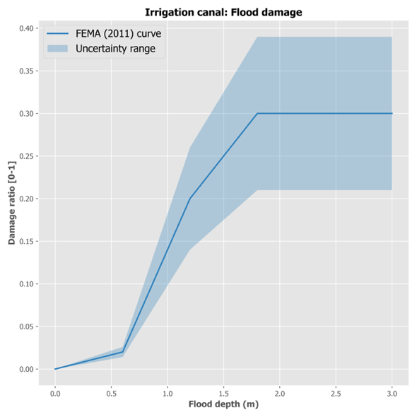 | (a) |
| 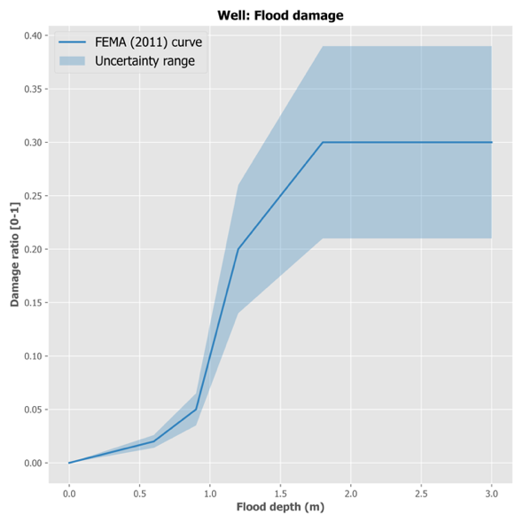 | (b) |
| 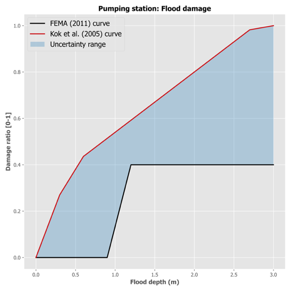 | (c) |
| 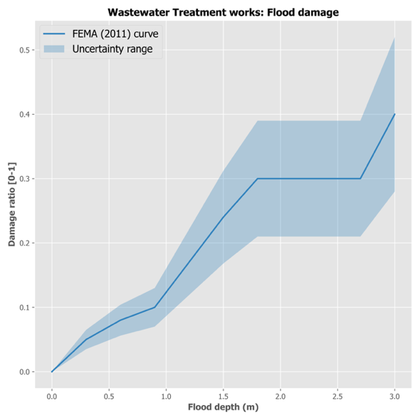 | (d) |
| 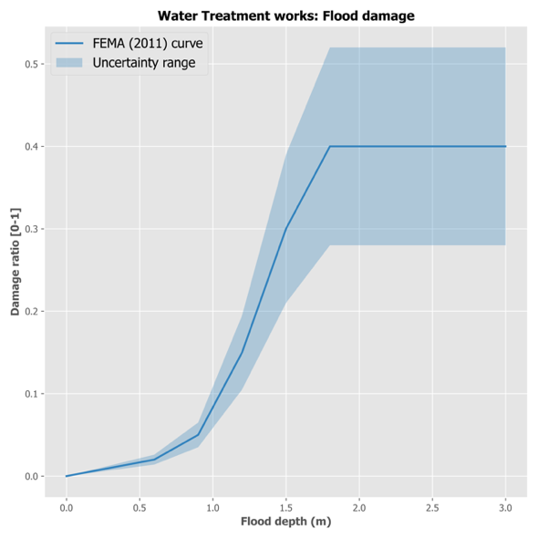 | (e) |
| 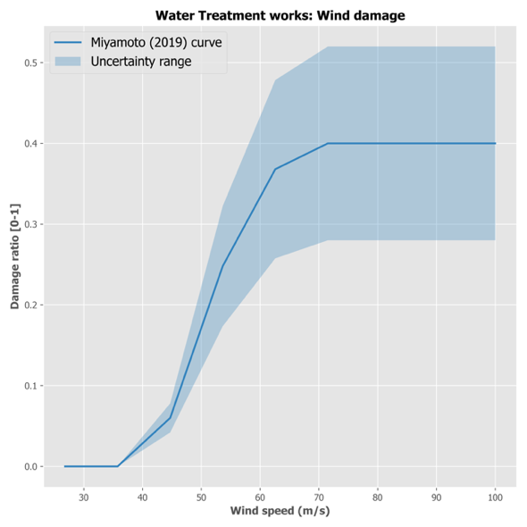 | (f) |

**Figure A-1: Flood and wind hazard damage curves for different water
assets considered in the study.**

|                                                                    |     |
| ------------------------------------------------------------------ | --- |
| 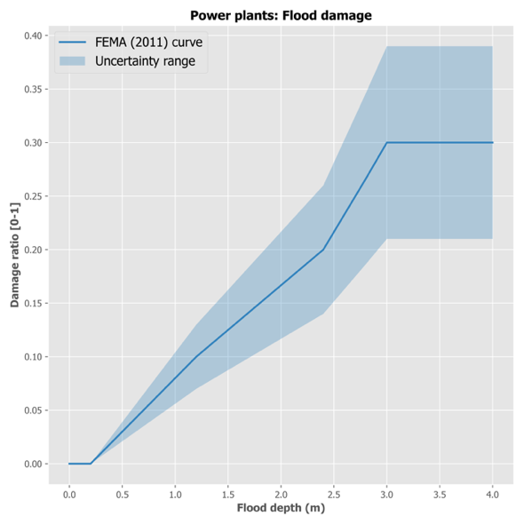 | (a) |
| 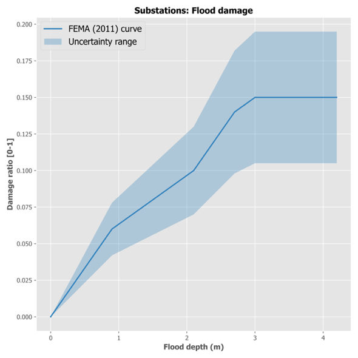 | (b) |
| 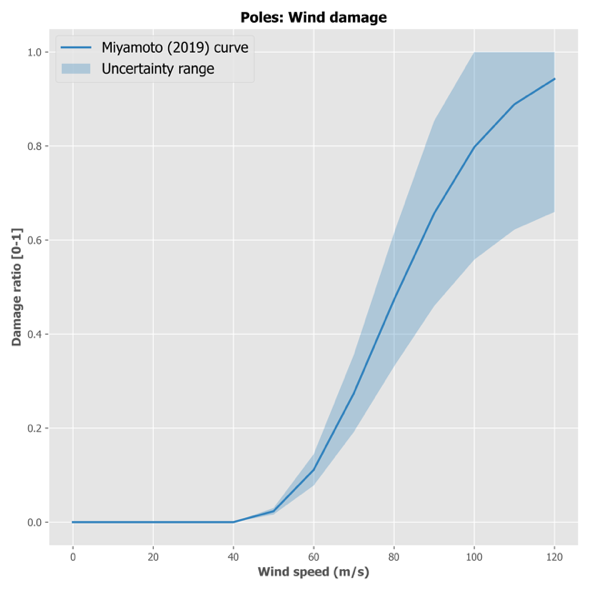 | (c) |
| 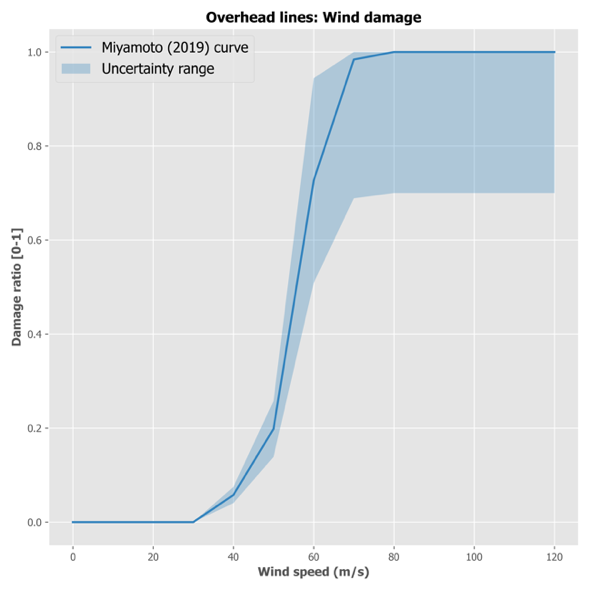 | (d) |
| 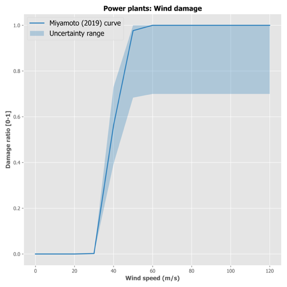 | (e) |
| 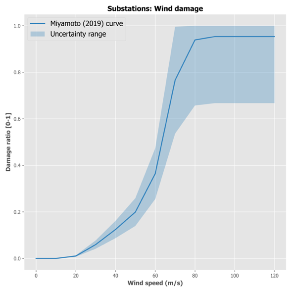 | (f) |

**Figure A-2: Flood and wind hazard damage curves for different energy
assets considered in the study.**

|                                                                |     |
| -------------------------------------------------------------- | --- |
| 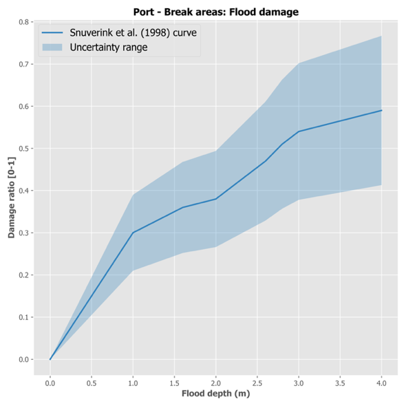 | (a) |
| 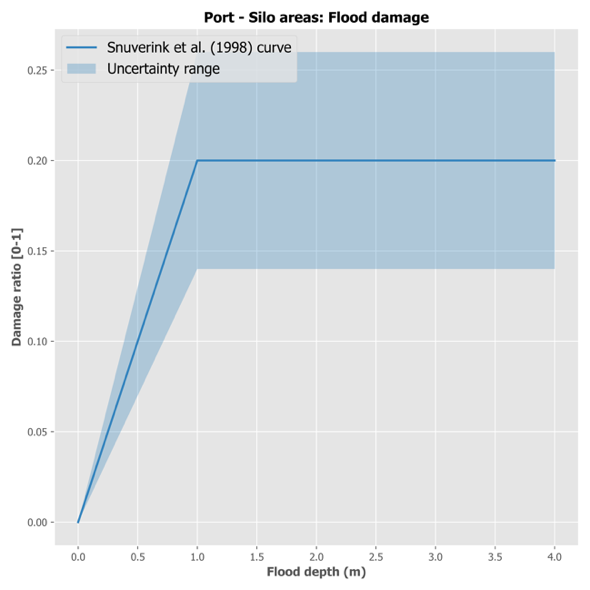 | (b) |
| 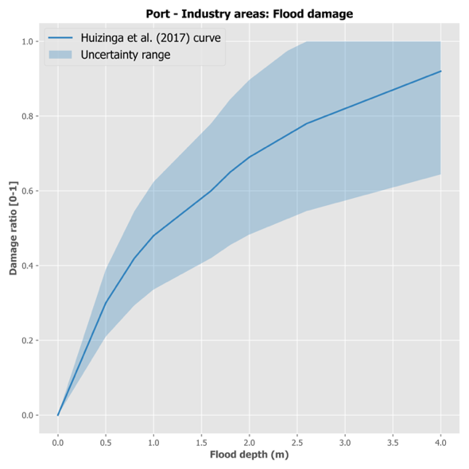 | (c) |
| 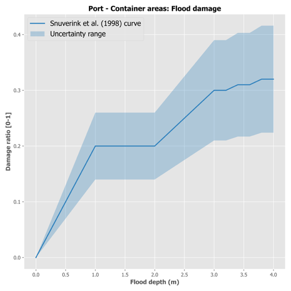 | (d) |
| 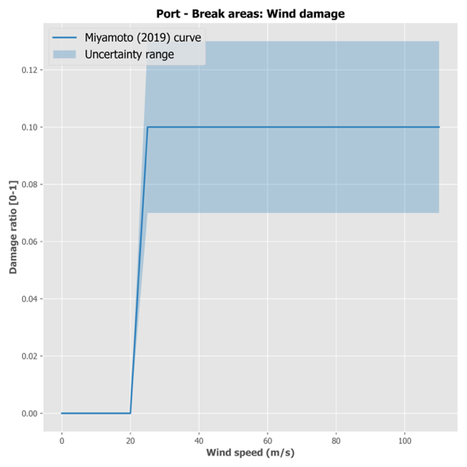 | (e) |
| 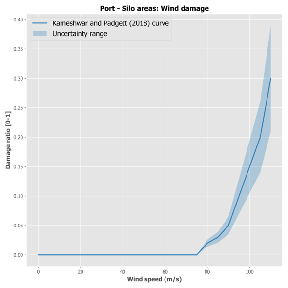 | (f) |

**Figure A-3: Flood and wind hazard damage curves for different port
assets considered in the study.**

|                                                                          |     |
| ------------------------------------------------------------------------ | --- |
|  | (a) |
| 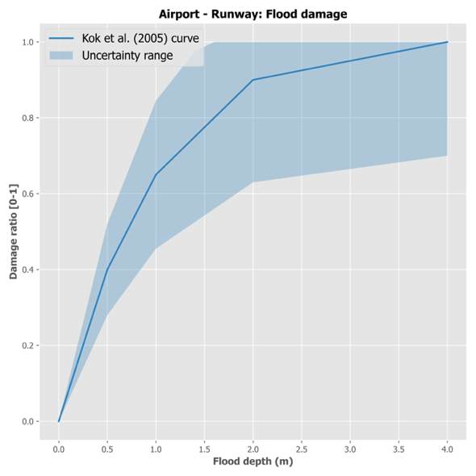 | (b) |
| 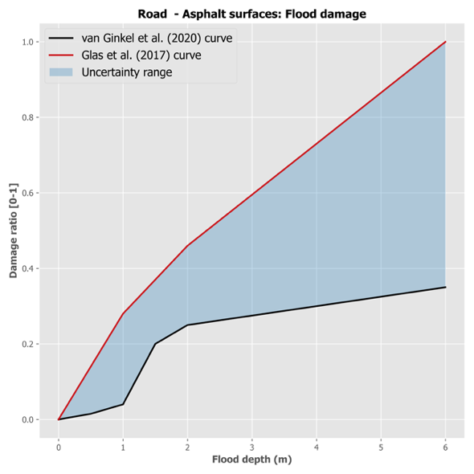 | (c) |
| 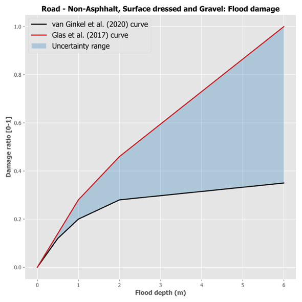 | (d) |
| 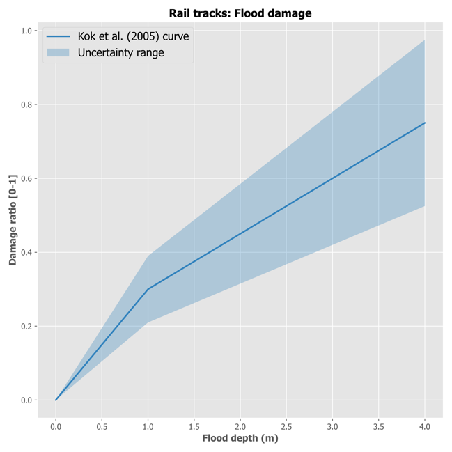 | (e) |

**Figure A-4: Flood hazard damage curves for different airport, road and
rail assets considered in the study.**

**References**

Burgess, C. P., Taylor, M. A., Stephenson, T., Mandal, A., and Powell,
L. (2015). A macro-scale flood risk model for Jamaica with impact of
climate variability. *Natural Hazards*, *78*(1), 231-256.

FEMA. (2011). Multi-hazard loss estimation methodology, Hurricane model:
Hazus-MH2.1 technical manual. Washington, DC: FEMA.

Freni, G., La Loggia, G., & Notaro, V. (2010). Uncertainty in urban
flood damage assessment due to urban drainage modelling and depth-damage
curve estimation. *Water Science and Technology*, *61*(12), 2979-2993.

Glas et al. (2017). A GIS-based tool for flood damage assessment and
delineation of a methodology for future risk assessment: case study for
Annotto Bay, Jamaica. Natural Hazards.

He, X., and Cha, E. J. (2021). Risk-Informed Decision-Making for
Predisaster Risk Mitigation Planning of Interdependent Infrastructure
Systems: Case Study of Jamaica. *Journal of Infrastructure
Systems*, *27*(4), 04021035.

Huizinga et al. (2017), Global flood depth-damage functions. Methodology
and the database with guidelines, JRC.

Jamaica Observer. (2018). Clarendon solar farm withstands heavy rains,
hurricane winds. url:
<https://www.jamaicaobserver.com/environment-watch/clarendon-solar-farm-withstands-heavy-rains-hurricane-winds_130178>
(Last accessed September 21, 2021).

Kameshwar and Padgett (2018), Fragility and resilience indicators for
portfolio of oil storage tanks subjected to Hurricane, ASCE.

Kok et al. (2005), Standaard method 2004 Schade en Slachtoffers als
gevolg van overstromingen, HKV lijn in water.

Miyamoto (2019), Overview of Engineering Options for Increasing
Infrastructure Resilience.

Ortega, S. T., Losada, I. J., Espejo, A., Abad, S., Narayan, S., & Beck,
M. W. (2019). The Flood Protection Benefits and Restoration Costs for
Mangroves in Jamaica.

Scorzini, A. R., and Frank, E. (2017). Flood damage curves: new insights
from the 2010 flood in Veneto, Italy. *Journal of Flood Risk
Management*, *10*(3), 381-392.

Snuverink et al. (1998), Schade by inundatie van buitendijkse industry,
Tebodin Consultants and Engineers, Rijkswaterstaat.

Tonn, G., and Czajkowski, J. (2018). *An analysis of US tropical cyclone
flood insurance claim losses: Storm surge vs. freshwater*. Risk
Management and Decision Processes Center, The Wharton School, University
of Pennsylvania.

van Ginkel et al. (2020), Direct flood risk assessment of the European
road network: an object-based approach, NHESS.

## Contents

1. [Introduction](01-introduction.md)
2. [Methodology development and implementation steps](02-methodology.md)
3. [Model assumptions and data assembled for implementing J-SRAT](03-model-assumptions-data.md)

- [Appendix A: Vulnerability curves for infrastructure assets in Jamaica](appendix-a-vulnerability-curves.md)
- [Appendix B: Hazard models](appendix-b-hazard-models.md)
- [Appendix C: Infrastructure network flow models for failure analysis](appendix-c-network-flow-models.md)
- [Appendix D: Spatial disaggregation of economic activity at buildings and area levels](appendix-d-spatial-disaggregation.md)
