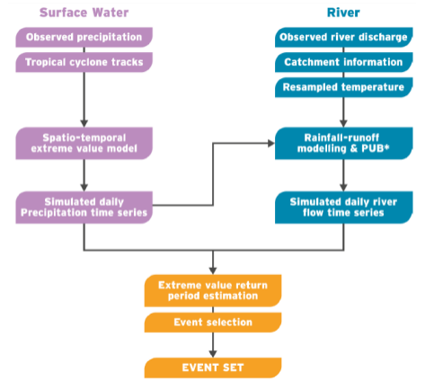

# Appendix B: Hazard models

## B.1 Fluvial and pluvial flood models

The fluvial and pluvial flood maps and flood event sets for Jamaica are
derived from JBA's Global Flood Model, which is a global probabilistic
river and surface model. The flood event set generation process follows
three stages as shown in Figure B-1. The rainfall and rainfall-runoff
are simulated at Observation Points (OPs), which are the locations of
the calibration (observed) data and additional locations in ungauged
river catchments. Discrete flood events are defined from the continuous
rainfall and rainfall-runoff time-series simulated at every OP. The
output for the rainfall-runoff modelling is a synthetic streamflow time
series in units of mm/day equivalent precipitation (defined using
catchment area). The resulting simulated daily precipitation and river
discharge data are then converted into return period estimates using
extreme value theory, and events are extracted from this to form the
final event set.

**Figure B-1: Methodology for creating event sets in the JBA Global
Flood Model.**

## B.2 Coastal flood model

The storm surge data is derived from a number of global data sources.
For Jamaica, no local Digital Elevation Model (DEM) was available, so
the Multi-Error Removed Improved-Terrain (MERIT) dataset[^54] was used
in this study. To model inundation, an extreme water level times series
was constructed. The values of the extreme water levels were based on
the Global Storm and Tide Model (GSTM)[^55], which provided storm+tide
return periods for the six return periods. For the future scenarios, no
change in the storm+tide was considered apart from sea level rise. Wave
setup was added to the dataset as well. Time series of local wave data
(36 years) were extracted from a global reanalysis dataset[^56]. Every
5km a transect was considered, and for every transact a reduction factor
was estimated based on the incoming wave direction and the angle of the
coast, which captures the wave sheltering effect of islands. Extreme
wave return periods were estimated based on these statistics (using a
Peak-over-Threshold methodology) and the wave setup was found by
assuming that setup is equal to 0.2 times the corrected offshore wave
height. No change in wave conditions is assumed for the future
scenarios.

For estimating flood depths, a physics-based inundation model was used,
the SFINCS model (Super-Fast Inundation of CoastS model)[^57], which is
a reduced-physics solver for large-scale flood modelling. The transect
data was linearly interpolated on a grid constructed around the island,
which was used for the inundation modelling. Storm duration was
schematized by a triangular hydrograph with the duration equal to eight
times the storm surge plus a factor ten (D = 8 \* surge + 10). To
construct future storm surge projections, the effect of sea level rise
was taken into consideration by extracting likely local sea level rise
estimates for two scenarios and four time slices. Local sea level rise
estimates were extracted from Vousdoukas et al. (2018)[^58]. All data
was rasterized to a 90-meter grid in line with the resolution of the
DEM.

## B.3 Tropical cyclone model

To estimate tropical cyclone (TC) wind speed, we use the 10,000
synthetic cyclone database STORM, developed by Bloemendaal et al.
(2020)[^59]. The STORM database contains 10-meter 10-minute sustained
maximum wind speeds at 10km resolution globally for 26 return periods
(ranging from 1 year to 10,000 year). Both the mean and 5-95^th^
percentiles of the return periods are included in the data, with the
uncertainty reflecting the uncertainty in the fitting parameters of the
extreme value distribution (Weibull distribution). We readily adopt this
data for Jamaica and use this as the baseline extreme wind conditions.

We create two future time slices, a mid-century and end-century time
period, and use a scaling factor to correct the wind speed based on the
expected change in extreme wind. We do this for two climate scenarios
(RCP4.5 and RCP8.5). In this analysis, we only change the maximum wind
speed, as these results are robust across models, and do not alter the
frequency of certain TCs occurring, as there is little consensus on this
for the North Atlantic TC basin[^60]. Based on a review of the studies
projecting changes in cyclone wind speed in the North Atlantic basin, we
identify six relevant studies that use CMIP5 models for their
evaluation. The end-century ranges provided by these studies are 4-6%
increase for RCP4.5 and 6.3-10.5% for RCP8.5. We use this range and
multiple the mean wind speed per return period with 5% for RCP4.5 and
8.4% for RCP8.5, while multiplying the 5^th^ and 95^th^ percentiles with
the lower and upper range. For the mid-century scenario, we assume that
the increase is approximately linear, resulting in a mean increase of 2%
under RCP4.5 and 3.5% under RCP8.5 (while adopting a similar approach
for the 5 and 95^th^ percentiles).

## B.4 Drought model

- Annual hydrological balance per major catchment

- REGCM4 present day and future climate change projections

_Analysis steps:_

1.  Find relationship between mean annual rainfall, evaporation, and
    surface water (SW)/groundwater (GW) supply

2.  Find annual variations in temperature and precipitation now and in
    future (RegCM4)

3.  Factor surface water and groundwater with respect to variations in
    precipitation and temperature

4.  Obtain annual sectoral demand from groundwater and surface water

_Data sources:_

- Parish supply plans: 2010 production limit[^61], leakage rates and
  demand

_Analysis steps:_

1.  Assign Water Supply Zones (WSZ) to each major catchment

2.  Find NWC water production limit, leakage rates and demand per major
    catchment per source based on parish plans

    a. Divide parish production limit in proportion to WSZ population
    served

    b. Apply leakage constantly across schemes in parish

    c. Determine which schemes are SW and which are GW, if both, assume
    50:50 split

3.  Find frequency of annual demand shortages for drinking water supply:

    a. Shortages occur when water input -- leakage \< demand

    b. Where SW/GW supply -- environmental flow $\geq$ production
    limit:

    <ul><li>water input = production limit,</li></ul>

    c. Where SW/GW supply -- environmental flow $<$ production limit:

    <ul><li> water input = SW/GW supply - environmental flow</li></ul>

    d. Where environmental flow = Q20 basin flow for SW[^62]

4.  Find total population disrupted per return period and per climate
    change scenario

5.  Disaggregate annual water shortage to find population disrupted per
    system

[^54]: http://hydro.iis.u-tokyo.ac.jp/\~yamadai/MERIT_DEM/
[^55]:
    Muis, S., Apecechea, M.I., Dullaart, J., de Lima Rego, J.,
    Madsen, K.S., Su, J., Yan, K. and Verlaan, M., 2020. A
    high-resolution global dataset of extreme sea levels, tides, and
    storm surges, including future projections. *Frontiers in Marine
    Science*, *7*, p.263.

[^56]:
    Giardino et al. (2020), Assessing the impact of sea level rise
    and resilience potential in the Caribbean, Technical Report,
    Deltares, the Netherlands.

[^57]: https://sfincs.readthedocs.io/en/latest/
[^58]:
    Vousdoukas, M.I., Mentaschi, L., Voukouvalas, E., Verlaan, M.,
    Jevrejeva, S., Jackson, L.P. and Feyen, L., 2018. Global
    probabilistic projections of extreme sea levels show intensification
    of coastal flood hazard. *Nature communications*, *9*(1), pp.1-12.

[^59]:
    Bloemendaal, N., Haigh, I.D., de Moel, H., Muis, S., Haarsma,
    R.J. and Aerts, J.C., 2020. Generation of a global synthetic
    tropical cyclone hazard dataset using STORM. *Scientific
    data*, *7*(1), pp.1-12.

[^60]:
    Knutson, T., Camargo, S.J., Chan, J.C., Emanuel, K., Ho, C.H.,
    Kossin, J., Mohapatra, M., Satoh, M., Sugi, M., Walsh, K. and Wu,
    L., 2020. Tropical cyclones and climate change assessment: Part II:
    Projected response to anthropogenic warming. *Bulletin of the
    American Meteorological Society*, *101*(3), pp. E303-E322.

[^61]: the maximum volume of water produced by NWC supply assets
[^62]: groundwater supply available represents renewable portion

## Contents

1. [Introduction](01-introduction.md)
2. [Methodology development and implementation steps](02-methodology.md)
3. [Model assumptions and data assembled for implementing J-SRAT](03-model-assumptions-data.md)

- [Appendix A: Vulnerability curves for infrastructure assets in Jamaica](appendix-a-vulnerability-curves.md)
- [Appendix B: Hazard models](appendix-b-hazard-models.md)
- [Appendix C: Infrastructure network flow models for failure analysis](appendix-c-network-flow-models.md)
- [Appendix D: Spatial disaggregation of economic activity at buildings and area levels](appendix-d-spatial-disaggregation.md)
