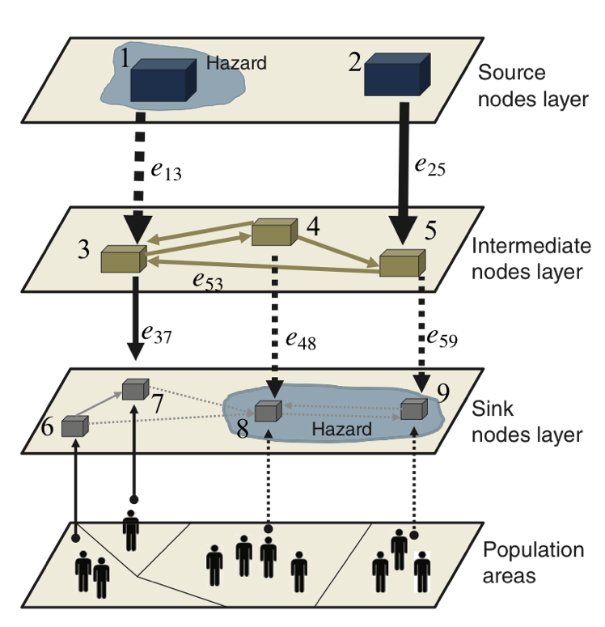
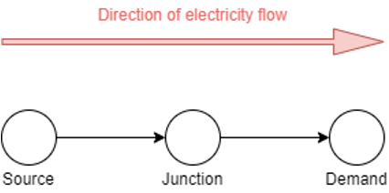
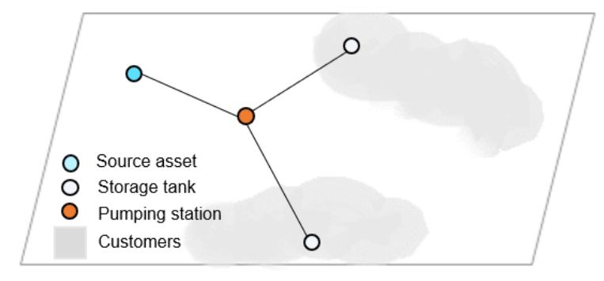

# Appendix C: Infrastructure network flow models for failure analysis

## C.1 Generalised network representations

All infrastructures are modelled as networks. The network topology is
represented as a graph $G = (N,E)$ with nodes $N = \{ 1,2,\ldots,n\}$
and edges $E = \ \left\{ e_{ij} = (i,j)\ \forall i,j \in N \right\}$,
where the relationship $e_{ij} = (i,j)$ shows that edge $e_{ij}$
connects from node $i$ towards $j$. All network edges are assumed to be
directed, that is $e_{ij} \neq e_{ji}$, to distinguish between the
direction and volumes of flows imposed on certain edges. Since all nodes
and edges in the graph $G$ represent physical assets, we denote this
collection of assets as $G = \left\{ g_{1},\ldots,g_{n} \right\}$.

The infrastructures have evolved into large spatially distributed
networks that generally exhibit multi-scale hierarchical
structures[^63]. Broadly there are three types of nodes layers in an
infrastructure network: (1) sources -- where resources are generated,
(2) intermediate/junctions -- where resources are transformed or
transmitted towards sinks, and (3) sinks -- which connect to direct
final users of resources. Generally, the asset sizes might diminish, and
asset numbers might increase from the source towards the sink layers.
Figure C-1 shows the generalised network formulation and hierarchical
representation conceptualised for this study.

**Figure C-1: Hierarchical network representation showing nodes and some
edge notations of a generalised infrastructure network as conceptualised
in this study (source: Pant et al. 2016**[^64]**).**

## C.2 Energy system model

The model of the energy system is formulated as a directed graph _G_
comprised of nodes _n_ ∈ _N_ and edges (_i_, _j_) ∈ _A._ Nodes in the
network represent physical electricity assets such as power plants and
transformers, but also represent aggregated demands associated with a
particular region. Meanwhile, edges in the network represent
transmission lines that carry electricity between nodes. There are three
types of nodes in the network: (i) sources, (ii) sinks, and (iii)
junctions. Source nodes _supply_ electricity and as such are comprised
of generation assets such as power stations. Sink nodes _demand_
electricity and hence are representative of a city or a large industrial
consumer (_e.g._, water treatment plant). Meanwhile, junction nodes
neither supply nor demand electricity and instead transform or split
flows of electricity (_e.g._, transformer). Figure C-2 shows a schematic
of the source-sink energy flow model.

**Figure C-2: Schematic of the edge-node energy flow model.**

JEM requires two main data inputs:

- **Spatial Data** -- Spatial datasets are generated to create a
  geographical representation of the Jamaican power grid. The spatial
  network is composed of a set of points (nodes) and lines (edges)
  that capture the locations of physical assets within the system.
  These data are used to define node types (e.g., generation,
  distribution, demand) and their network and asset categories. Nodes
  also require specific attributes such as capacity, losses, and
  efficiencies.

- **Temporal Data** -- Temporal data describe the supply and demand
  associated with source and sink nodes, respectively. A unique time
  series is assigned to each source and sink node at an hourly
  resolution. Table C-1 shows a small sample of this data.

**Table C-1: Example of time series nodal supply/demand data.**

| Time [h] | Power Plant [MWh] | Demand [MWh] | Wind Farm [MWh] |
| -------: | ----------------: | -----------: | --------------: |
|        1 |              1000 |          250 |               0 |
|        2 |              1000 |          260 |               0 |
|        3 |              1000 |          270 |               0 |
|        4 |              1000 |          300 |              10 |
|        5 |              1000 |          310 |              20 |

A network linear programming (NLP) optimisation algorithm is used for
the simulation model. The formulation of the algorithm can be generally
expressed as:

| **minimise:**   | Cost of flows across the network    |
| --------------- | ----------------------------------- |
| **subject to:** | (1) Supply                          |
|                 | (2) Demand                          |
|                 | (3) Conservation of energy          |
|                 | (4) Energy system operational rules |

The objective of the NLP optimisation routine is to minimise the total
cost of electricity supply and distribution _C_ across the simulation
period such that:

$\underset{x}{min.}{C = \sum_{t = 1}^{T}{x_{t}c_{t}}}$ (C.1)

where _x~t~_ is the flow of electricity across a given edge at time _t_
and *c~t\ ~*is the unit cost of electricity along the edge. The cost of
flow along each edge is a function of the distance of the power line.
The supply constraint denotes that the flow from a supply node _i_ to
node _j_ cannot exceed the generation _S~i~_ at a given time step such
that:

$\sum_{j:ij \in A}^{}{x_{ij,t} \leq S_{i,t}\ \forall\ (i,j)\ and\ t}$
(C.2)

Meanwhile, the demand constraint denotes that demand at node _j_ must be
met for each time step, such that:

$\sum_{j:ij \in A}^{}{x_{ij,t} = D_{j,t}}\forall\ (i,j)\ and\ t$ (C.3)

In cases where demand cannot be met by the system, supply is drawn from
a 'hidden' network layer known as the _super source_. The super source
node can provide an infinite amount of supply at any given time step but
is only used if no other supply is available. This serves to ensure
model feasibility and helps to quantify the supply shortage. A
conservation of energy constraint is also set to indicate that the total
energy input into a node must equal the total energy output, such that:

$\sum_{j:ij \in A}^{}{x_{ij,t} - \sum_{j:ij \in A}^{}{q_{ji,t}x_{ji,t}} = 0}\ \forall\ (i,j)\ and\ t$
(C.4)

In the equation above, the parameter _q_ ∈ \[0,1\] indicates the total
losses from a given power line. Flows along each edge are subject to
minimum and upper bound constraints (_h_ and _u_, respectively). That
is, the total transmission along a given edge cannot exceed its capacity
and must be above the minimum transmission (if applicable), such that:

${h_{ij,t}\  \leq x}_{ij,t} \leq u_{ij,t}\ \forall\ (i,j)\ and\ t$ (C.5)

The output from electricity generation sites is subject to the ramping
constraint _µ_ of the given technology. For example, natural gas plants
have a higher ramping rate as compared to coal-fired power plants. As
such, the following constraint is imposed:

$x_{ij,t} - x_{ij,t - 1} \leq \mu_{i}\ \forall\ (i,j)\ and\ t$ (C.6)

For the economic loss calculations due to electricity failures, we
estimate the GDP disrupted at the sink (demand) nodes in the network.
When the source and sink nodes fail in the electricity network we trace
the network effects of their failures to the demand nodes, as explained
in Section 3.4.1. This demand node GDP disruption is a combination of
the GDP directly generated by the electricity sector and the GDP of
other infrastructures and businesses that are indirectly dependent on
electricity. The following method is applied:

1.  We first spatially disaggregate the GDP/day (henceforth referred to as GDP)
    estimates from the electricity sector (Section E 401) to the demand nodes,
    by assuming that this spatial distribution of GDP is proportional to the
    population served by each demand node. This gives us the directly generated
    electricity sector GDP at the demand node level.

2.  We map all the commercial buildings within the electricity demand
    service areas (see Figure **_3‑9_**) to find all the GDP associated
    with non-residential buildings (see Section 3.3.2 and 3.3.3) that
    would be indirectly disrupted when electricity is disrupted.

3.  We assume that two other infrastructure sectors are also dependent
    upon electricity -- telecoms and potable water and telecoms.

    a. We collect data from the water sector (NWC disruption notices)
    to infer where electricity outages are causing water
    disruptions, and use this information to identify the locations
    of water nodes connected to electricity demand nodes. This helps
    us simulate disruptions in the potable water network to find the
    water sector GDP disrupted for all households and buildings
    using water (described in the next section).

    b. We obtain a Jamaica wide dataset on 2,526 telecom masts spread
    across the island from the NSDMD database (the original data
    sources are from NEPA, Digicel, Mona Geoinformatics Institute).
    <ol>
    <li> We assume at the telecom masts within the service area of
        each electricity demand node are getting their electricity
        supply from that demand node. Hence, the GDP generated by
        these telecoms mast would be dependent upon the electricity
        demand node, and disrupted if the demand node is disrupted.</li>

    <li> We assume that these telecom masts serve the whole
        population of Jamaica and the service areas of each mast is
        estimated using Voronoi polygons to map nearest population
        to each mast. Using the GDP estimates of the post office and
        telecoms sector (I 640) we estimate that
        84.3% of this GDP is generated from the telecoms sector
        only[^65].</li>

    <li>We then disaggregate the telecoms sector GDP to each mast
            in proportion to the customers served by each mast.</li>
    </ol>

4.  We only counted the unique set of buildings disrupted due to
    electricity or water disruptions in order to avoid double counting
    the building GDP that is dependent upon electricity and water
    supply.

5.  From step 1-2 we can estimate the GDP/day disrupted (direct
    electricity + indirect from telecoms, potable water and
    non-residential businesses) due to electricity demand node
    disruptions.

6.  We note that we have excluded transport assets due to lack of an
    understanding of the specific assets that are connected to the
    electricity nodes.

## C.3 Water systems models

### C.3.1 Potable water demand assembly and disruption analysis

The potable supply network of Jamaica was conceptualised as a network of
nodes and edges (pipes). The nodes were classified in three categories
of: (i) _sources_ -- these were assets where the water supply was
introduced into the network and included assets such as entombments,
filter plants, intakes, production wells, reservoirs, river sources,
springs, treatment plants ; (ii) _intermediaries_ -- these were assets
which transmit the water further along the network and included assets
such as booster stations, pump stations, relift stations; and (iii)
_sinks_ -- these were assets from which the water supply would be
finally linked to customers (households and businesses) and included
assets such as reservoirs and storage tanks. Figure C-3 shows an example
of the directed network graph of the water network.

**Figure C-3: Graphic representation of a directed sub-system in the
Jamaica potable water network.**

The Jamaica potable water network was found to be a collection of
smaller networks or sub-systems, which operate independently of each
other, and each sub-system had at least one source, intermediary and
sink nodes. These sub-systems were first identified by associating them
with known Water Supply Zones (WSZ) that showed areas in Jamaica
receiving water supply from the NWC. This was done through:

1.  Data from the Water Service Plans (WSPs) and disruption notices from
    the NWC, which provided information on all source, intermediary and
    sink nodes supplying water to each WSZ;

2.  For nodes not identified in the WSPs we assigned them to the WSZ
    that they were located inside of. Some WSZs did not have assets or
    sources, which may be because the asset data we had was outdated and
    new assets were missing.

Once all the sub-systems were identified, we assigned customers
(population and businesses) to them and did the disruption analysis in
following steps:

1.  We intersected the WSZ areas with the population areas of Jamaica to
    infer total number of people within each WSZ. Based on data from the
    Parish Supply Plans on fraction of customers serviced within Parish
    in 2010 and projections for 2030, we were able to estimate the
    number of water customers serviced within each WSZ in 2019 or for
    any future projected year. We assumed that the GDP generated by the
    potable water supply sector (Section E 410) was
    spatially disaggregated to the WSZs in proportion to the population
    within each WSZ.

2.  We also intersected the WSZ areas with the building footprints of
    commercial buildings in Jamaica and associated each building's GDP
    (see Section 3.3.2) with each WSZ.

3.  We next disaggregated the customers (population and/or businesses)
    served per WSZ to each asset by assuming:

    a. Each source node served the entire WSZ it was associated with.
    This is a conservative estimate as we don't know the
    proportionate contribution if multiple sources served the same
    WSZ.

    b. Each intermediary node also served the entire WSZ it was mapped
    to.

    c. Sink nodes equally serve their allocated WSZs, which meant that
    the fraction of WSZ customers assigned to each sink node was
    equal to (1/number of sinks in WSZ)×(served population of WSZ).

4.  We assigned each pipeline to the closest node and assigned customers
    served by that node to the pipeline. Some WSZs did not have a piped
    network, which may be because assets have been built since the
    database was created or because they are missing.

5.  From steps 1-4 we found the total population and GDP (from water
    household customers + buildings dependent on water) served by each
    water asset by adding up its contribution to each WSZ it was
    supplying to.

6.  For disruption analysis we assumed that:

    a. If one node or edge failed, the customers and GDP served by that
    asset are all disrupted.

    b. If multiple nodes or edges failed, we take the maximum customers
    disrupted in a WSZ across all failed assets in order to avoid
    multiple counting.

### C.3.2 Irrigation demand mapping and disruption analysis

The irrigation asset demands were estimated in the following steps:

1.  Allocate irrigation assets (wells, canals and pipelines) to
    different irrigation schemes.

2.  Intersect the irrigation scheme area with the agriculture GDP areas
    (see Section 3.3.3) and estimate the agriculture GDP/area associated
    with each irrigation scheme.

3.  Find fraction of scheme served by each irrigation asset type by
    applying following rules:

    a. Area served per well = 1/number of wells per scheme. This is a
    conservative estimate because we do not know the contribution
    from surface water sources.

    b. Area served per pipe = (pipe size)/(sum of pipe sizes). The grid
    network structure of the pipes provides a high level of
    redundancy, meaning that other pipe networks are unlikely to be
    cut-off if one fails.

    c. Area served per canal = either known value or in proportion to
    the length of the canal. It is unknown how water sources combine
    along the canal and how much is extracted from each section,
    therefore we assume water is abstracted proportionally to canal
    length.

4.  For disruption analysis we assumed that:

    a. If one node or edge failed, we assumed the area the asset served
    was disrupted and hence the GDP over that area was disrupted.

    b. If multiple nodes or edges failed, we summed the areas and the
    GDP over those areas to get the combined effect of all failed
    assets.

## C.4 Transport system model

### C.4.1 Transport flow allocation

The transport system is modelled as a multi-modal network graph composed
of roads, railways, airports and ports. The multi-modal linkages are
created by identifying the linkages from rail stations to their nearest
road nodes, the linkages that exist between ports and key rail stations
and ports and their nearest road nodes, and the linkages that exist
between airports and their nearest road nodes.

Commodity and industry flows on the transport network are estimated from
the import-export trade flow statistics of Jamaica, compiled from
STATIN[^66],[^67]. These statistics are shown for exports in Table C-2
and for imports in Table C-3, where the sector code and subsector code
mapping has been created by us to match commodities to specific
industries as per the JIC 2005 system (see Table 3‑5). We
converted these statistics from annual estimates to daily estimates by
dividing by 365 to obtain values in J\$/day.

From the commodities and industries mapped above we are able to map
trade flows in following steps:

1.  We infer that the main exports out of Jamaica are in Agriculture
    (Sector A), Fisheries (Sector B), Mining (Sector C), Manufacturing
    (Sector D).

2.  The main imports into Jamaica are in Retail and Trade (Sector G),
    Construction (Sector F), and Fuels which are used by Mining (Sector
    C), Automobile trade (Sector G) and Manufacturing (Sector D).

3.  We assume that all the export-import trade flows have to pass
    through the ports in Jamaica, for which we know the annual tonnage
    statistics and main commodity goods being shipped through the ports

4.  Once we identify the ports, and their industries we assume that the
    export and import of a particular industry through a port would be
    in proportion to the tonnage volume of that industry's export and
    import handled at the port. For example, from Table C-4 we estimate
    that Sector A, B, D, F, G exports will be shipped through mainly
    four locations in Jamaica, with Kingston Terminals handling 96% of
    the cargo, 3.6% will be handled at Ocho Rios port and 0.4% at
    Montego Bay port. Hence, we assume that the export trade values in
    J\$ (from Table C-2) shipped for each industry to these ports will
    also be in same proportion.

5.  Once we identify the ports we estimate the locations within Jamaica
    from and to which the commodities will be shipped for exports and
    imports. Exports will be sent from within the country towards the
    ports and imports will arrive at the ports and sent within the
    country.

    a. We assume that only the mining industry exports will be sent via
    rail and road to the ports handling mining products. For all
    other industry exports, we assume that only roads will be used
    to transport commodities to the ports handling those
    commodities.

    b. We assume that all imports will be sent from ports to location
    within the country via the road network only.

    c. We assume that the locations of exports and imports within
    Jamaica by industry are based on the different areas and
    buildings designated to those industries.
    <ol>
    <li>All agriculture (sector A) commodity exports would be from
        the locations of the agriculture areas assigned to
        specific crops, as described in Section D.3.</li>

    <li>All mining (sector C) exports would be from the locations of
        the mining areas identified in the country and connected
        to ports, as described in Section D.4.</li>

    <li>All fishery (sector B) exports would be from the locations
        of the aquatic farms identified in the country, as
        described in Section 3.3.3.</li>

    <li>For the other sectors of manufacturing (sector D),
        construction (sector F) retail and trade (sector G) the
        exports and imports would be between locations of
        buildings assigned to these sectors, based on the building
        footprint data described in Section 3.3.2.</li>

    <li>We assume that all fuel imported within the country would be
        arriving at three types of locations[^68]: 64% at the
        Petrojam port facility, 21% at other ports from where it
        will be shipped to automobile parts shops (sector G), and
        15% to the ports connected to the mines.</li>
    </ol>

6.  After the locations of export-import are identified, we assign the
    value of trade between these locations and ports in the following
    steps:

    a. We identify the least-time route connecting each port to any
    location of economic activity identified for different sectors
    from Step 5 above). This results in estimating which locations
    would be connected to their most preferred ports, and the route
    to those ports.

    b. Once we have identified all the least-time connectivity routes,
    we disaggregate the value of trade (export and import) assigned
    to the port (from Step 4 above) to the routes. This is done in
    proportion to GDP assigned to the locations connecting to the
    ports. For example, if we know all the mines connected to the
    ports, the export trade share of each port ($e_{i}$) and the GDP
    associated with each mine (${GDP}_{j}$) (see Section D.4), then
    we assume that the value of trade assigned to a mine ($j$) and
    its route to the port ($i$) will be equal to
    $e_{i}\frac{{GDP}_{j}}{\sum_{j}^{}{GDP}_{j}}$ where the
    summation is over the GDP of each mine connected to the port.
    The same principle is applied to all other sector trade routes
    value allocations.

The result of the implementation of the Step 1-6
outlined above, can be represented in terms of the total value of
daily trade in J\$/day along edges of rail and road networks.

In addition to the allocation of trade values, we also allocate clusters
of working populations to clusters of business activities via the road
network. We assume that the GDP associated with non-residential
buildings will depend upon the ability of the workforce to access these
buildings. Hence, we build a road flow assignment model to find routes
from locations where working populations are concentrated to locations
where GDP is concentrated. To do such a road flow assignment we
implement the following steps:

1.  We take the Enumeration District (ED) level working population data
    (see Figure 3‑3) and disaggregate it to the residential buildings
    with each ED. We assume that the allocation to residential buildings
    is done in proportion to the areas of the buildings.

2.  We find the nearest road node to each residential building and
    aggregate the total number of working populations to their nearest
    road nodes.

3.  We also take all the non-residential buildings in the country and
    find the nearest road nodes to each building, to estimate the
    aggregated GDP assigned to its nearest road node.

4.  Once we have identified all the road nodes where labour is
    concentrated and where GDP is concentrated, we implement a radiation
    model for estimating the commuter patterns along roads. This is a
    well researched problem in transport modelling, where radiation
    models have been developed to quantify such movements[^69],[^70].
    The overall aim of such models is to understand how likely are
    people to travel to work based on employment opportunities in
    surrounding areas, which depends on the concentration of
    populations, workforce and GDP. We create a radiation model, which
    is a variation of the model proposed by Pivoni et al. (2018)[^71].
    According to our radiation model, the working population $e_{i}$ at
    an origin location $i$ on the road network is likely to travel of
    another destination location $j$ within a distance (or travel time)
    of $d_{ij}$ based on the GDP opportunities ${GDP}_{i}$ and
    ${GDP}_{j}$ at the locations $i,j$ and all other opportunities
    ${GDP}_{ij}$ within the travel distance between the two locations.
    The number of working people $w_{ij}$ who will move from location
    $i$ to location $j$ to seek employment is estimated as shown in
    Equation C.1.

$w_{ij} = \ e_{i}\frac{{GDP}_{j}/({GDP}_{i} + {GDP}_{ij})}{\sum_{k}^{}{{GDP}_{k}/({GDP}_{i} + {GDP}_{ik})}}$
(C.1)

$w_{ij}$ also indicate how much of the working population 'flow' will
happen along the road network between the locations $i,j$, which we
assign to the least-cost route connecting the two locations^75,76^.

5.  The implementation of Equation C.1 is done as following:

    a. We assume that the working population would look for employment
    opportunities which are within 1 hour of travel time from them,
    i.e., $d_{ij} = 1\ hour$.

    b. We implement a least-cost route assignment algorithm developed in
    Python.

6.  We also estimate how much of the GDP is associated with each route,
    as per Equation C.2.

${GDP}_{ij} = \ {GDP}_{j}\frac{w_{ij}}{\sum_{i}^{}w_{ij}}$ (C.2)

### C.4.2 Transport flow disruption analysis

From the flow assignment analysis, leading to Figure **_C-5_** and
Figure C-6, we are able to create a large set of origins-destinations,
travel routes, value of trade and GDP in J\$/day. The transport failure
and disruption analysis that follows this flow assignment analysis,
involves the following steps:

1.  We first assemble the set of transport nodes and edges that are
    considered damaged due to a hazard event. Here a set includes at
    least one node or edge.

2.  We remove the set of damaged transport assets from their networks.

3.  We find all the travel routes that include the damaged assets, which
    are assumed to now be disrupted due to transport damages.

4.  We re-run the flow assignment for these disrupted routes to find the
    next best routes based on least-cost (least-time) assignment along
    the remaining network. This is called the process of rerouting
    flows.

5.  From the rerouting process we get two possible outcomes for each
    route:

    a. There is an alternative route along the network, which is now
    assigned to complete the trip between the origin-destination
    pair. But this comes at a higher cost of transport, which we
    estimate in terms of the increased time to travel. Assuming that
    the increased travel time between origin-destination (OD) pair
    $i,j$ is ${\mathrm{\Delta}t}_{ij}$ in hours, the associated
    pre-disruption trade flow is $f_{ij}$ in J\$/day, the number of
    workers commuting before disruption are $w_{ij}$ then the
    rerouting loss associated with the OD-pair is estimated as:

    $l*{ij} = \ 0.02{\mathrm{\Delta}t}*{ij}f*{ij} + 136.82{\mathrm{\Delta}t}*{ij}w\_{ij}\ $
    (C.3)

    Where the value 0.02 or 2% is based on the study of Hummels and Schaur
    (2013)[^72], who studied United States and global trade data and found
    that each hour of delay to imports results in 2% loss of value of
    trade. The 136.82 is the estimate of wage losses in J\$/person/day,
    which is estimated by assuming the average basic hourly rate of
    employees in Jamaica from STATIN statistics of 2009 was 235.25
    J\$/hour[^73], adjusted to 2019 values by assuming 45.4% inflation
    from 2009-2019[^74] and each hour of delay in travel results in 40%
    loss of wages[^75]. We note that the network losses associated with
    labour rerouting will only apply for the road network disruptions, as
    we assume rail networks are only used for trade flows of mining
    products.

b. There is no alternative route along the network, which means that
due to asset damages the network flows have been cut-off resulting
in loss of the trade and GDP assigned to that origin-destination
journey. In this case we add up all the trade and GDP values due to
all trips lost, to get the economic loss in J\$/day attributed to
failed nodes and edges.

6.  The implementation of Step 5 above gives us the estimate of the
    economic losses due to transport disruptions along each disrupted
    journey. For a given failure scenario of damaged nodes and edge we
    can find the sum over all OD routes that incur rerouting and flow
    cut-off losses.

We note that in the above methodology we have not estimated economic losses due
to disruption to airports. Unfortunately, there is very little information on
freight data patterns and employment for airports in Jamaica. However, we know
the passenger estimates for airports in Jamaica from AAJ data (see Table 3‑15),
and we have estimates that suggest that airports in Jamaica on average generate
35 US\$ per passenger revenues[^76]. Hence, if an airport is disrupted we
estimate the economic losses (in US\$/day) associated with the disruption to be
equal to 35US\$×(number of annual passengers/365).

[^63]:
    Thacker, S., Pant, R. and Hall, J.W., 2017b. System-of-systems
    formulation and disruption analysis for multi-scale critical
    national infrastructures. *Reliability Engineering & System
    Safety*, *167*, pp.30-41.

[^64]:
    Pant, R., Thacker, S., Hall, J.W. and Alderson, D.
    (2018). Critical infrastructure impact assessment due to flood
    exposure. *Journal of Flood Risk Management*, _11_(1), pp.22-33. Doi
    <http://dx.doi.org/10.1111/jfr3.12288>.

[^65]:
    MSET (2009). Vision 2030 Jamaica -- Information and
    Communications Technology (ICT) Sector plan 2009 - 2030:
    <https://www.mset.gov.jm/wp-content/uploads/2019/09/ICT-Sector-Plan-Complete.pdf>

[^66]: <https://statinja.gov.jm/Trade-Econ%20Statistics/InternationalMerchandiseTrade/newtrade.aspx>
[^67]: <https://statinja.gov.jm/Trade-Econ%20Statistics/InternationalMerchandiseTrade/newtrade.aspx>
[^68]:
    Based on information from the Ministry of Science, Energy and
    Technology (MSET):
    <https://www.mset.gov.jm/wp-content/uploads/2020/06/JAMAICA-ENERGY-STATISTICS-2020.pdf>

[^69]:
    Simini, F., González, M. C., Maritan, A., & Barabási, A. L.
    (2012). A universal model for mobility and migration patterns.
    _Nature_, _484_(7392), 96-100.

[^70]:
    Ren, Y., Ercsey-Ravasz, M., Wang, P., González, M. C., &
    Toroczkai, Z. (2014). Predicting commuter flows in spatial networks
    using a radiation model based on temporal ranges. _Nature
    communications_, _5_(1), 1-9.

[^71]:
    Piovani, D., Arcaute, E., Uchoa, G., Wilson, A., & Batty, M.
    (2018). Measuring accessibility using gravity and radiation models.
    _Royal Society open science_, _5_(9), 171668.

[^72]:
    Hummels, D. L., & Schaur, G. (2013). Time as a trade barrier.
    _American Economic Review_, _103_(7), 2935-59.

[^73]: <https://statinja.gov.jm/BasicHourlyRateOfHoursRatedWageEarnessinLgEstMIG.aspx>
[^74]: <https://www.statista.com/statistics/527084/inflation-rate-in-jamaica/>
[^75]: <https://www.vtpi.org/tca/tca0502.pdf>
[^76]: <https://jamaica-gleaner.com/article/business/20211121/jamaica-city-airports-earn-us75m-nine-months-travel-recovery-slow>

## Contents

1. [Introduction](01-introduction.md)
2. [Methodology development and implementation steps](02-methodology.md)
3. [Model assumptions and data assembled for implementing J-SRAT](03-model-assumptions-data.md)

- [Appendix A: Vulnerability curves for infrastructure assets in Jamaica](appendix-a-vulnerability-curves.md)
- [Appendix B: Hazard models](appendix-b-hazard-models.md)
- [Appendix C: Infrastructure network flow models for failure analysis](appendix-c-network-flow-models.md)
- [Appendix D: Spatial disaggregation of economic activity at buildings and area levels](appendix-d-spatial-disaggregation.md)
